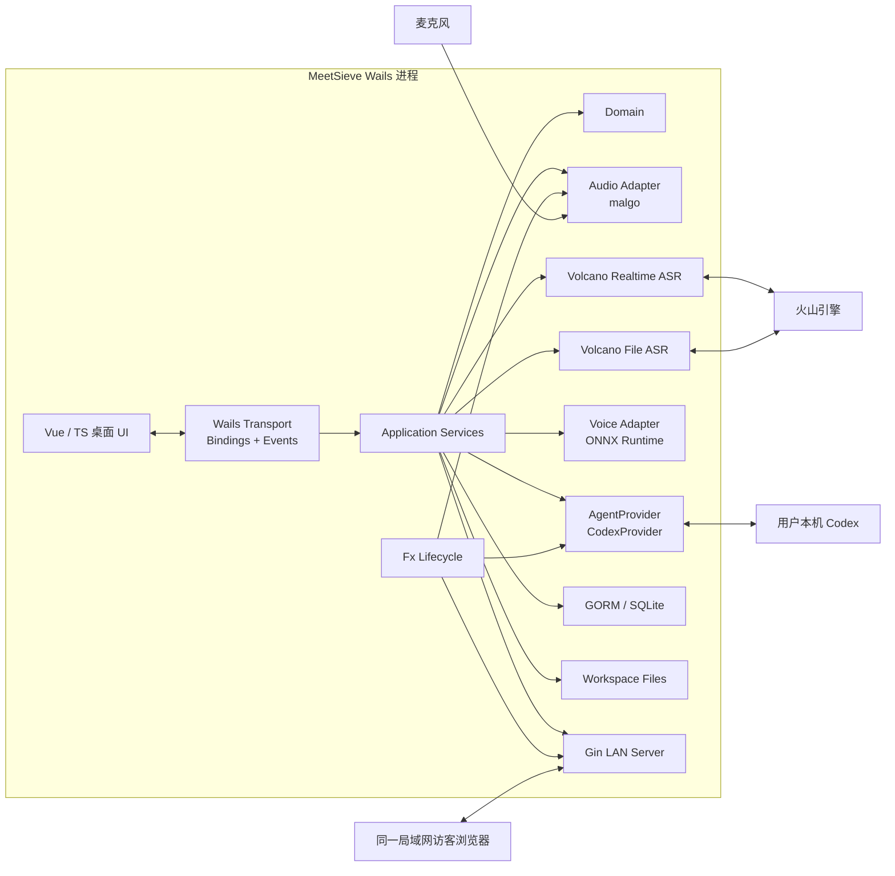
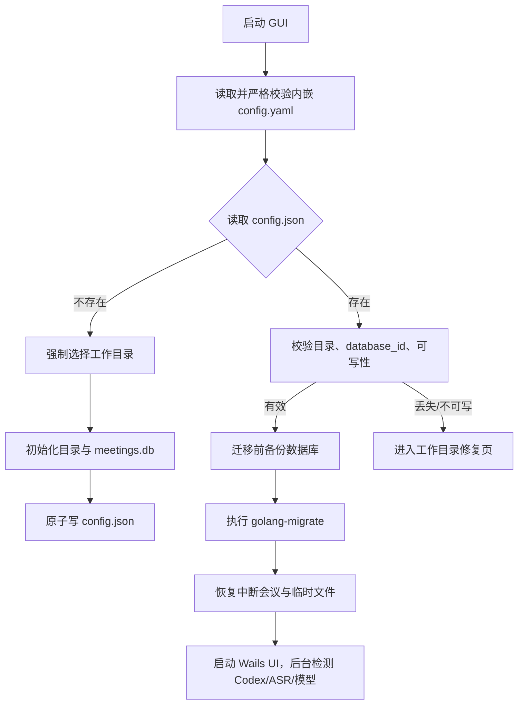
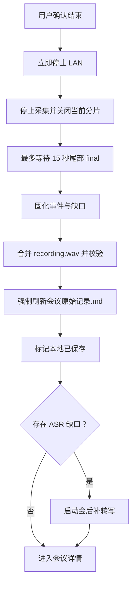

# 会意（MeetSieve）技术方案

## 文档信息

| 项目 | 内容 |
| --- | --- |
| 需求名称 | 会意（MeetSieve）AI 会议助手 |
| 项目标识 | `meet-sieve` |
| 需求号 | 未提供 |
| 文档状态 | 待评审 |
| 文档类型 | 技术设计 |
| 创建时间 | 2026-07-29 |
| 最后更新时间 | 2026-07-30 |
| 首发平台 | macOS、Windows |
| 代码仓库 | `/Users/liu/develop/code-space/meet-sieve` |
| 开发分支 | `main` |
| 前端入口 | Wails v2 内嵌 Vue 桌面页面、Gin 提供局域网访客页 |
| 后端入口 | Wails Go 主进程 |
| 外部依赖 | 火山引擎实时 ASR、火山引擎录音文件 ASR、用户本机 Codex |
| 配置 | 内嵌 `config.yaml`；用户引导配置 `config.json`；业务设置保存在 SQLite |
| 数据库 | SQLite + GORM + `golang-migrate` |
| 发布方式 | macOS arm64 DMG；Windows amd64 NSIS 安装程序 |
| 签名状态 | 本期 macOS 不签名、不公证；Windows Alpha 不配置代码签名 |
| 计划口径 | 两天后交付完整功能 Alpha 测试包，不使用假数据伪装真实链路 |

## 1. 依据与优先级

### 1.1 需求依据

1. [PRD-AI会议助手.md](../../../../../work/projects/20260727会议助手/设计方案/PRD-AI会议助手.md)
2. [用户旅程.md](../../../../../work/projects/20260727会议助手/设计方案/用户旅程.md)
3. [UI产品设计规格.md](../../../../../work/projects/20260727会议助手/设计方案/UI产品设计规格.md)
4. [MeetSieve Figma 设计稿](https://www.figma.com/design/0BX2FXaxxjB4i7Jn5Hfjt8/%E4%BC%9A%E6%84%8F-MeetSieve-%E2%80%94-Product-UI-v1?node-id=1-4&p=f&t=drDjZBaZKMdBczls-0)
5. 本次技术方案访谈中逐项确认的产品与技术决策。
6. 后端工程模式参考 `/Users/liu/develop/code-space/code-gate`。

### 1.2 事实优先级

当材料存在冲突时，按以下顺序处理：

1. 本次访谈中用户明确确认的决策；
2. PRD、用户旅程和 UI 产品设计规格；
3. Figma 中已绘制的页面和状态；
4. 参考项目的工程做法；
5. 框架惯例和技术建议。

参考项目只提供工程组织思路，不直接继承其业务规则。例如，MeetSieve 的局域网 HTTP 接口不继承 CodeGate“所有 HTTP 状态恒为 200”的特殊约束。

### 1.3 已确认的需求覆盖

以下决策覆盖原材料中的旧口径：

| 主题 | 本方案采用的最新决策 |
| --- | --- |
| 首发平台 | 仅 macOS、Windows，不包含 Linux |
| Wails | 使用 Wails v2，不使用 v3 Alpha |
| 项目目录 | 删除“关联项目目录”“小组默认项目目录”概念；用户只选择一次会议工作目录 |
| Codex 工作目录 | 每场会议自动使用其独立会议目录作为 `cwd` |
| 本地 CLI / Skill | 不开发 MeetSieve CLI，不随应用提供 Codex Skill |
| Codex 恢复 | 优先恢复 thread；失败时由 Codex 直接读取会议目录中的 Markdown 和附件 |
| Codex 权限 | MeetSieve 内只读；用户离开 MeetSieve 后可在自己的 Codex 中恢复 thread 并自行执行写入或插件操作 |
| Codex 登录 | 用户自行安装并登录 Codex；MeetSieve 不管理登录、令牌或账号 |
| Codex 模型 | 使用用户 Codex 的默认模型，不提供模型选择器 |
| 唤醒词 | 默认“AI 助手”，允许用户修改 |
| 访客身份 | 填写临时显示名称，不选择或冒充正式成员 |
| 会议结束后的 LAN | 立即停止访客访问，不保留只读宽限期 |
| 附件上下文 | 访客消息和附件上传成功后自动进入 Codex 上下文，不增加主持人确认步骤 |
| ASR 凭证 | 明文保存在 SQLite；不使用 Keychain 或 Credential Manager |
| SQLite 位置 | 位于用户工作目录的 `data/meetings.db` |
| 声纹样本位置 | 位于用户工作目录，不放操作系统应用数据目录 |
| 会后补转写 | 本期包含，使用独立的火山引擎录音文件识别接口 |
| 纪要生成 | 必须由用户主动触发，不在结束会议时自动生成 |
| 上传共享位置 | MeetSieve 内不直接执行；会议结束后给出可复制的 Codex 恢复命令和说明 |
| 当前交付范围 | 完整 Figma 页面、声纹、校对、LAN、500 MB 附件、会后补转写、成员与小组、NSIS、Codex 快照和纪要均进入本期 Alpha |
| 隐私提示 | 不增加独立的首次 ASR/录音知情确认流程；录音状态仍必须清晰可见 |

## 2. 背景、目标与非目标

### 2.1 背景

MeetSieve 是 2～10 人线下会议使用的本地桌面工具。它把本地录音、实时转写、说话人识别、访客消息、附件和 AI 问答统一沉淀为可追溯的会议事件，使 Codex 能在会中按需回答，并在会后生成会议纪要草稿。

系统的核心约束是：

```text
本地 SQLite 与会议文件 = 唯一事实源
Codex thread = 可恢复、可替换的工作会话
```

### 2.2 目标

1. 用户只需在一台电脑上开始和结束会议，录音与 final 转写可靠落盘。
2. Codex 被唤醒时能够获得此前会议上下文，无需参会者重新描述背景。
3. Codex thread 丢失后，仍可从会议目录恢复上下文。
4. 会议结束后能够补齐实时 ASR 缺口，并允许人工校对。
5. 访客在同一 Wi-Fi 内无需账号即可发送消息、链接和附件。
6. 所有核心数据均保存在用户可迁移的本地工作目录。
7. 架构以 `AgentProvider` 隔离 Codex，后续可增加其他智能体实现。

### 2.3 非目标

1. 商业化账号、计费、租户、云端团队空间和权限系统。
2. 替代远程音视频会议平台。
3. 多台设备同时录音、音轨融合或云端声纹库。
4. 自动发布未经用户确认的纪要。
5. MeetSieve 内的写项目文件、执行副作用插件或上传共享文档。
6. 自动更新；本期由用户手动安装新版本。
7. macOS 签名、公证及 Windows 代码签名。
8. 多 ASR 服务商。
9. MeetSieve 自有 CLI、MCP 或 Codex Skill。
10. 托盘驻留、隐藏后台录音和并行会议。

## 3. 技术栈与运行约束

| 层级 | 选型 | 约束 |
| --- | --- | --- |
| 桌面容器 | Wails v2 | 固定使用稳定版；初始化时锁定到 `v2.13.0` |
| 后端语言 | Go 1.25 | 由 `mise.toml` 管理 |
| 依赖注入 | Uber Fx | 所有长生命周期组件通过 Fx lifecycle 启停 |
| 桌面交互 | Wails bindings + events | 桌面端不通过本机 HTTP 调 Go |
| LAN HTTP | Gin | 只服务当前会议的访客页面与 API |
| ORM | GORM | 使用官方 SQLite driver |
| SQLite driver | `gorm.io/driver/sqlite` / `go-sqlite3` | 需要 CGO |
| 数据迁移 | `golang-migrate` | 内嵌版本化 SQL；禁用 GORM AutoMigrate |
| 前端 | Vue 3 + TypeScript + Vite | Vue Router、Pinia |
| UI | 自有轻量组件 + CSS Variables | 不引入 Element、Ant Design、Tailwind |
| 音频 | `malgo` / miniaudio | 技术门禁验证后锁版本 |
| 声纹推理 | ONNX Runtime + `VoiceEncoder` | 模型作为安装资源携带 |
| 实时 ASR | 火山引擎流式 ASR | WebSocket，实时 partial/final |
| 补转写 | 火山引擎录音文件极速版 | 资源 `volc.bigasr.auc_turbo` |
| 智能体 | 用户本机 `codex app-server` | stdio JSONL / JSON-RPC |
| 日志 | Zap 结构化 JSON | 敏感信息脱敏 |
| 构建 | Makefile + mise | macOS 主机构建 macOS 和 Windows 产物 |
| Windows 安装 | NSIS | per-machine，可选择安装目录 |
| macOS 安装 | DMG + `.app` | arm64，未签名、未公证 |

Wails 官方支持生成 [NSIS 安装程序](https://wails.io/docs/guides/windows-installer/)，但 Wails v2、CGO、SQLite、音频库和 ONNX Runtime 组合下的 macOS→Windows 构建属于本项目必须真实验证的高风险链路，不能仅以“编译命令退出 0”视为可交付。

## 4. 总体架构



### 4.1 进程边界

MeetSieve 只包含一个可见的 Wails GUI 主进程。下列对象是受控子进程或动态库，不向用户弹出终端：

- `codex app-server`：Go 主进程通过 stdin/stdout 管理；
- ONNX Runtime：由应用加载的本地动态库；
- NSIS 安装和卸载程序：仅在安装、卸载时运行。

应用不启动独立 Go 后端服务供桌面 UI 调用。Gin 只在会议期间监听选定的局域网 IP。

### 4.2 分层原则

- `domain` 不依赖 Wails、Gin、GORM、火山 SDK、Codex 或 ONNX Runtime。
- `service` 编排会议流程、事务、状态和补偿，不直接操作厂商协议。
- `port` 定义音频、ASR、智能体、声纹、文件和时钟等外部能力。
- `adapter` 实现具体协议和平台能力。
- `transport/wails` 只做参数校验、调用 service 和事件转换。
- `transport/http` 只处理访客 API，不承担会议业务流程。
- `infra` 提供配置、日志、数据库、迁移、文件系统和 Gin Engine。
- 构造函数只装配依赖，不启动 goroutine、不连接外部服务、不迁移数据。

### 4.3 推荐工程结构

```text
meet-sieve/
├── cmd/meetsieve/                 # Wails 主入口
├── configs/                       # go:embed 的 config.yaml
├── migrations/sqlite/             # golang-migrate SQL
├── models/                         # 声纹模型清单、哈希和许可证
├── frontend/                       # Vue 3 + TS + Vite
├── internal/
│   ├── app/                        # Fx 装配与应用生命周期
│   ├── domain/                     # 领域模型、状态和值对象
│   ├── service/                    # 会议、转写、纪要等业务编排
│   ├── port/                       # 外部能力接口
│   ├── adapter/
│   │   ├── audio/
│   │   ├── asr/volcano/
│   │   ├── voice/onnx/
│   │   └── agent/codex/
│   ├── infra/
│   │   ├── config/
│   │   ├── database/
│   │   ├── filesystem/
│   │   ├── logger/
│   │   └── ginx/
│   └── transport/
│       ├── wails/
│       └── http/
├── tests/
│   ├── unit/
│   ├── integration/
│   ├── contract/
│   └── e2e/
├── build/                          # Wails/NSIS/DMG 资源
├── Makefile
├── mise.toml
└── wails.json
```

## 5. 生命周期管理

### 5.1 应用启动



启动顺序必须保证：

1. 未定位工作目录前不尝试打开数据库；
2. 数据库迁移完成前不启动业务 service；
3. Codex、ASR 和 LAN 均不是应用启动的硬依赖；
4. migration 失败时停止进入业务界面，保留原数据库和备份；
5. 上次崩溃的录音会议进入“中断待恢复”，不能直接继续原会议录音。

### 5.2 应用关闭

- 无会议进行时：停止 Codex 子进程、后台 runner、数据库和日志后退出。
- 正在录音时：阻止直接关闭，提供“继续会议”或“结束会议并退出”。
- 结束并退出：执行正常收尾；本地落盘失败时不得伪装为已保存。
- 不提供“隐藏到托盘继续录音”。

### 5.3 长生命周期组件

以下组件必须注册 Fx `OnStart` / `OnStop`，并由同一个根 `context` 管理：

- 音频采集 runner；
- 实时 ASR 会话；
- Codex app-server 子进程及 JSON-RPC reader；
- Gin LAN server；
- Markdown 投影 writer；
- 文件上传清理与恢复任务；
- 声纹 embedding 重建任务。

所有 goroutine 必须有明确停止路径；同一应用实例最多存在一场录音会议和一个进行中的 Codex turn。

## 6. 安装、配置与数据目录

### 6.1 安装目录

安装目录只放不可变资源：

```text
MeetSieve executable / .app
ONNX Runtime DLL / dylib
声纹模型
Web 前端内嵌资源
许可证与第三方声明
```

禁止把 `config.json`、SQLite、日志、录音或附件写入安装目录。

Windows：

- per-machine NSIS 安装；
- 默认安装到 `C:\Program Files\MeetSieve`；
- 安装时允许用户选择其他目录；
- 创建开始菜单和可选桌面快捷方式；
- 应用使用 GUI subsystem，双击不弹终端；
- 安装器添加仅适用于“专用网络”的程序入站规则；
- 卸载时移除该防火墙规则。

macOS：

- 生成 Apple Silicon（arm64）`.app` 和 DMG；
- 本期不签名、不公证；
- 测试说明中提供 Gatekeeper 手动放行方式；
- 架构预留未来签名和公证步骤，但不作为本期验收。

### 6.2 内嵌配置

`configs/config.yaml` 使用 `go:embed` 编入二进制，包含开发和运行默认值，例如：

- 日志轮转；
- SQLite PRAGMA；
- 音频分片时长；
- ASR 超时和重试上限；
- Codex 超时；
- LAN 上传限制；
- 声纹模型清单。

配置使用严格反序列化和启动校验，未知字段或非法值直接报错。它不是用户配置文件，不在 UI 中展示。

### 6.3 引导配置

固定位置：

- macOS：`~/Library/Application Support/MeetSieve/config.json`
- Windows：`%AppData%\MeetSieve\config.json`

最小结构：

```json
{
  "schema_version": 1,
  "workspace_path": "/absolute/path/ai-meetings",
  "database_id": "uuid",
  "last_app_version": "0.1.0"
}
```

约束：

- 只保存定位数据库所必需的引导信息；
- 不保存业务设置、会议信息或密钥；
- 使用临时文件 + fsync + 原子替换；
- `database_id` 必须与数据库元信息一致，防止误连其他 SQLite；
- 指向目录不存在或不可写时，不自动创建空库，进入修复页；
- 用户必须明确选择后才能创建全新工作目录。

### 6.4 工作目录

```text
ai-meetings/
├── data/
│   ├── meetings.db
│   ├── meetings.db-wal
│   ├── meetings.db-shm
│   ├── backups/
│   └── voice-samples/
│       └── <member-uuid>/
│           └── <sample-uuid>.wav
└── meetings/
    └── <会议号>-<安全化主题>/
        ├── 会议原始记录.md
        ├── 会议纪要草稿.md
        ├── audio/
        │   ├── recording.wav
        │   └── segments/
        │       └── 000001.wav
        └── resources/
```

SQLite 是业务数据唯一事实源；Markdown 是可重建投影。目录名只用于人读，内部关联一律使用不可变 UUID。

### 6.5 修改工作目录

设置页提供“迁移工作目录”，不允许直接改路径：

1. 禁止在会议进行中迁移；
2. 校验目标目录为空或可安全初始化；
3. 停止数据库和文件 writer；
4. 复制数据库、会议文件和声纹样本；
5. 校验文件数量、大小和 SHA-256；
6. 打开目标数据库并核对 `database_id`；
7. 原子更新 `config.json`；
8. 成功后保留旧目录，不自动删除。

任何步骤失败都继续使用旧目录。

## 7. 数据库与数据模型

### 7.1 SQLite 运行参数

每次连接必须设置并验证：

```text
journal_mode = WAL
foreign_keys = ON
busy_timeout = 5000
synchronous = NORMAL
```

写入采用单 writer 语义。录音、ASR、LAN、Codex 回调先进入有界内部队列，由 event service 在短事务中分配事件序号并落库，避免多 goroutine 争用 SQLite 写锁。

### 7.2 迁移与备份

- 使用 `golang-migrate` 和内嵌的 `up/down.sql`；
- 正式启动禁止 `AutoMigrate`；
- 每次存在待执行 migration 时，先备份 `meetings.db`；
- 备份位于 `data/backups/`，只保留最近 3 份；
- 普通启动无 migration 时不重复备份；
- migration 失败时不自动执行有风险的数据回滚；
- 禁止在数据库迁移过程中启动会议。

### 7.3 核心表

所有表使用 UUID 主键，并具备 `created_at`、`updated_at`；可归档实体增加 `archived_at`。迁移 SQL 中必须给表和字段写中文注释。

| 表 | 作用与关键约束 |
| --- | --- |
| `app_metadata` | `database_id`、schema 语义版本、设备码 |
| `settings` | ASR 凭证、默认麦克风、唤醒词、用户设置；ASR 凭证明文保存 |
| `members` | 成员姓名、备注、归档状态 |
| `groups` | 小组名称、默认 LAN 开关等当前设置 |
| `group_members` | 小组与成员多对多关系 |
| `meetings` | UUID、会议号、主题、目录、开始/结束时间及正交状态 |
| `meeting_participants` | 本场成员快照或临时参会人快照；历史不可变 |
| `meeting_events` | 统一事件头：`meeting_id`、`seq`、`kind`、业务时间、来源 |
| `utterances` | final 转写、原文、当前校对文本、音频时间范围、ASR speaker |
| `messages` | 主持人或访客文字消息、临时显示名 |
| `resources` | 链接/附件、原始文件名、安全文件名、大小、SHA-256、状态 |
| `corrections` | 文本、说话人、消息归属或附件说明的修正记录 |
| `audio_assets` | 分片、合并录音、缺口片段的路径、时间范围、校验值 |
| `asr_sessions` | 实时 ASR 会话、重连次数和匿名 speaker 作用域 |
| `asr_gaps` | 断线缺口、补转写任务、结果和冲突状态 |
| `voice_samples` | 成员声纹原音频、质量状态、文件哈希 |
| `voice_embeddings` | 样本、模型 ID/版本/哈希和 embedding BLOB |
| `speaker_clusters` | 单场会议内的未知说话人聚类 |
| `agent_sessions` | provider、Codex thread ID、恢复关系、`cwd` |
| `agent_turns` | 初始化、会中回答、纪要生成的 turn 状态与超时 |
| `sync_batches` | 事件范围、幂等键、同步状态 |
| `context_snapshots` | 定长结构化上下文快照及生成 turn |
| `minute_versions` | AI 草稿、人工修改稿、确认状态和当前版本 |
| `deletion_jobs` | 会议或录音删除的文件与数据库收尾状态 |

### 7.4 会议号

展示编号：

```text
YYYYMMDD-设备码-当日序号
```

规则：

- 安装初始化时生成稳定四位设备码；
- 当日序号在 SQLite 事务内分配；
- 会议号只允许在开始录音前修改；
- 开始后锁定；
- `(meeting_no)` 唯一；
- 内部 UUID 永不修改。

### 7.5 统一事件序号

持久事件均分配 `(meeting_id, seq)`，其中 `seq` 从 1 单调递增，并建立唯一约束。

事件类型至少包括：

```text
utterance.final
message.created
resource.created
utterance.corrected
speaker.corrected
resource.corrected
ai.question
ai.answer
ai.cancelled
asr.gap
asr.compensated
```

partial 只存在于内存和 Wails UI 事件，不进入 SQLite，也不占用持久事件序号。

原始 ASR 文本永不被不可逆覆盖；校对写入 correction，并更新当前投影视图。Markdown 生成器按事件序号和最新 correction 确定性输出。

## 8. 会议状态与核心流程

### 8.1 正交状态

禁止用一个 `meeting.status` 同时表达录音、保存、ASR、Codex 和纪要。至少拆分：

| 状态轴 | 值 |
| --- | --- |
| `lifecycle_state` | `preparing / recording / finalizing / ended / interrupted / deleting / delete_failed` |
| `local_save_state` | `pending / saving / saved / failed` |
| `realtime_asr_state` | `idle / connecting / streaming / reconnecting / unavailable / stopped` |
| `gap_state` | `none / pending / processing / completed / failed / conflict` |
| `agent_state` | `unchecked / initializing / available / busy / unavailable / unsynced` |
| `minute_state` | `not_generated / generating / draft / confirmed / failed` |
| `lan_state` | `disabled / starting / serving / failed / stopped` |

### 8.2 开始会议

1. 校验工作目录和可用磁盘空间；
2. 校验麦克风并取得系统权限；
3. 事务创建 meeting、参会者快照和会议目录记录；
4. 创建实际会议目录；
5. 启动第一个 60 秒音频分片并确认可写；
6. 将会议切换为 `recording`；
7. 启动实时 ASR；失败时让用户选择“仅录音继续”或取消；
8. 按配置启动 LAN；
9. 后台启动或连接 Codex app-server，并创建本场 thread。

只有步骤 1～6 全部成功才算会议开始。Codex 初始化失败、LAN 失败或 ASR 被用户选择降级均不丢失本地录音。

### 8.3 会议中

- 单个麦克风采集；
- 每 60 秒安全关闭一个 WAV 分片并创建下一个；
- 音频按顺序同时送入实时 ASR；
- partial 覆盖当前 UI 行；
- final 只固化一次；
- ASR 断线时录音继续，记录精确缺口并指数退避重连；
- final 到达后执行本场说话人候选匹配；
- LAN 消息、附件和公开 AI 回答进入统一事件流；
- 当前 Codex turn 运行时忽略新的唤醒触发，但正常保存对应转写。

### 8.4 结束会议



Codex 结束同步不是本地保存完成的前置条件。会议结束后不自动生成纪要。

### 8.5 崩溃恢复

启动时发现 `recording` 或 `finalizing`：

1. 标记为 `interrupted`；
2. 扫描并校验已关闭的音频分片；
3. 修复可修复的 WAV header；
4. 尝试合并现有分片；
5. 根据已有 final 生成原始记录；
6. 把未覆盖的音频范围登记为 ASR gap；
7. 允许用户执行会后补转写；
8. 禁止在原会议上继续录音，用户需开始新会议。

## 9. 音频与 ASR

### 9.1 音频采集

`AudioCapture` port 提供：

```text
ListDevices
TestDevice
Start
ReadFrames
Stop
```

首选 `malgo`/miniaudio，原因是同一 API 可覆盖 macOS CoreAudio 和 Windows WASAPI。锁定依赖前必须完成真实验证：

- macOS arm64 连续录音；
- Windows amd64 连续录音；
- 设备拔出、切换和权限拒绝；
- Wails GUI 构建后的动态库加载；
- 与 ONNX Runtime、go-sqlite3 同时启用 CGO。

内部统一为 16 kHz、16-bit、mono PCM。若设备原生格式不同，在音频 adapter 中重采样；同一标准流供 ASR、声纹和归档，避免时间轴漂移。

### 9.2 分片与合并

- 分片长度 60 秒；
- 写入时先使用临时扩展名，关闭和 fsync 后原子重命名为 `.wav`；
- `audio_assets` 保存序号、起止采样点、时长、大小和 SHA-256；
- 正常结束后顺序合并为 `recording.wav`；
- 合并完成且校验通过后才允许清理分片；
- 合并失败保留全部分片并显示可恢复状态。

### 9.3 实时 ASR

`RealtimeTranscriber` port 屏蔽火山协议，输出：

```text
Partial
Final
SessionStarted
Disconnected
Reconnected
Failed
```

规则：

- partial 只用于 UI；
- final 使用 ASR 结果 ID + 会话 ID 幂等；
- anonymous speaker 只在单个 ASR session 内有效；
- 重连后不得把相同 speaker 编号当成同一个人；
- 断线开始和恢复时间使用本地音频采样点确定，不依赖墙上时钟估算；
- 停止采集后最多等待 15 秒 final，超时部分登记为 gap。

### 9.4 会后缺口补转写

会后补转写通过独立 `FileTranscriber` port 调用火山引擎“大模型录音文件极速版”。官方限制为单文件不超过 2 小时、100 MB，资源 ID 为 `volc.bigasr.auc_turbo`；本项目只上传缺口音频，并优先把请求控制在 20 MB 内。

处理流程：

1. 根据 gap 的采样点从分片或 `recording.wav` 提取音频；
2. 合并相邻缺口；
3. 超过接口限制时按静音点拆分；
4. 调用录音文件 ASR；
5. 把返回时间映射回会议绝对时间；
6. 与已有 final 检查重叠；
7. 无冲突结果自动写入事件流，标记来源为 `file_asr`；
8. 有重叠或文本冲突时保留两份结果，标记 `conflict`，要求人工校对。

补转写失败时，用户仍可主动生成纪要，但界面必须明确提示缺口范围；纪要请求中必须包含该缺口信息。

## 10. 声纹与说话人

### 10.1 组件边界

```go
// VoiceEncoder 定义本地声纹特征提取能力。
type VoiceEncoder interface {
    Encode(ctx context.Context, pcm AudioPCM) (Embedding, error)
    ModelInfo() ModelInfo
}
```

业务层只依赖 `VoiceEncoder`，ONNX Runtime、输入张量、归一化和模型文件由 adapter 封装。

### 10.2 模型携带

- 模型文件随 `.app` / NSIS 安装；
- 不使用 `go:embed` 放入 Go 二进制；
- 安装资源记录模型 ID、版本、SHA-256 和许可证；
- 启动时验证模型和 ONNX Runtime 架构；
- 模型文件本身跨平台，ONNX Runtime 分平台、分架构携带；
- 模型版本变化后，旧 embedding 不参与新模型比较。

当前没有已确认的模型文件。工程实现必须在声纹功能验收前完成技术门禁，由开发者选择 ECAPA-TDNN 类候选并记录 ADR，至少验证：

1. 模型许可证允许随应用分发；
2. macOS arm64/amd64 和 Windows amd64 可运行；
3. 输入格式和 embedding 维度稳定；
4. 2～10 人真实远场、短句、回声和重叠语音效果；
5. 基于真实样本确定阈值和 `unknown` 策略。

在上述验证前，不得编造阈值或宣称声纹识别完成。

### 10.3 声纹样本

- 成员可以没有声纹；
- 每个样本保存原始 WAV，embedding 保存到 SQLite；
- 原音频和向量均不加密；
- 用户主动添加样本；
- 删除声纹时删除样本音频和 embedding，不改写历史会议；
- 模型升级时根据原始样本后台重建 embedding；
- 重建期间允许录音和转写，但关闭自动说话人匹配。

### 10.4 匹配与校对

- 只与本场最多 10 名正式参会者线性比较；
- 低于已验证阈值时显示未知，不强行认人；
- 未知说话人只在单场会议内聚类为“未知说话人 1、2……”；
- 不跨会议追踪匿名人员；
- 默认人工修改只影响选中的片段；
- 可显式选择“修改本场该未知说话人的全部片段”；
- 只有用户单独点击“加入声纹样本”并确认，校对片段才进入永久声纹库。

## 11. Codex 与智能体架构

### 11.1 Provider 策略

```go
// AgentProvider 定义会议智能体的稳定业务能力。
type AgentProvider interface {
    CheckAvailability(ctx context.Context) Availability
    StartSession(ctx context.Context, req StartSessionRequest) (AgentSession, error)
    ResumeSession(ctx context.Context, req ResumeSessionRequest) (AgentSession, error)
    RunTurn(ctx context.Context, req RunTurnRequest) (<-chan AgentEvent, error)
    InterruptTurn(ctx context.Context, sessionID string, turnID string) error
}
```

首期只注册 `CodexProvider`。不得在界面展示未实现的智能体选项。未来增加智能体时，通过新 adapter 实现同一 port，不修改会议事件和纪要领域模型。

### 11.2 Codex 连接

采用用户本机 `codex app-server`：

- Go 进程启动 `codex app-server`；
- 默认 stdio transport；
- stdin/stdout 使用逐行 JSON；
- 连接后先发送 `initialize`，再发送 `initialized`；
- 创建会话使用 `thread/start`；
- 恢复使用 `thread/resume`；
- 开始回合使用 `turn/start`；
- 取消使用 `turn/interrupt`；
- 以 `turn/completed` 的最终状态判断成功、失败或取消；
- 以 `item/agentMessage/delta` 流式更新 UI，以 `item/completed` 为最终权威结果。

该协议由 Codex 官方 [App Server](https://learn.chatgpt.com/docs/app-server) 提供，但 CLI 中 `app-server` 仍标为 experimental。实现时必须：

1. 检测 `codex --version`；
2. 使用当前安装版本生成 JSON Schema 并做契约测试；
3. 将协议差异限制在 `CodexProvider`；
4. 不使用实验性 API 字段，除非单独验证并记录；
5. 协议不兼容时禁用 AI，不影响录音和转写。

### 11.3 用户登录与默认配置

- MeetSieve 不读取、显示或保存 Codex 登录凭据；
- 用户必须自行完成 `codex login`；
- MeetSieve 只检测 app-server 能否启动；
- 不指定模型，让 Codex 使用用户默认模型；
- 不提供 Codex 路径以外的复杂配置界面；
- Codex 不可用时，录音、转写、校对、LAN 和会议保存继续工作。

### 11.4 权限

MeetSieve 内的 Codex turn 必须使用只读文件系统策略：

- `cwd` 固定为当前会议目录；
- 不授予项目或工作目录写权限；
- MeetSieve 对文件修改、命令提权和额外权限请求一律拒绝；
- 允许只读读取会议 Markdown、附件和本地资料；
- 允许用户 Codex 默认支持的只读 Web 搜索；
- 提示词明确把访客消息和附件视为不可信内容，不能覆盖系统指令；
- MeetSieve 不主动调用有副作用的 MCP、插件或工具。

由于 MeetSieve 使用用户默认 Codex 环境，用户自行配置的第三方工具是否严格执行只读边界需要真实验证。Alpha 验收必须包含恶意附件和工具调用测试；不能只依赖提示词宣称安全。

### 11.5 thread 生命周期

- 每场会议对应独立 thread；
- thread 的 `cwd` 是当前会议目录；
- 创建本地会议、启动麦克风并安全打开首个音频分片后，才后台创建 thread；
- 初始化 turn 完成后才显示“AI 可参与”；
- 同一会议后续回答优先复用同一 thread；
- `agent_sessions` 保存当前和历史 thread 及恢复关系；
- thread 丢失时创建新 thread，读取 `会议原始记录.md`、上下文快照和 `resources/`；
- MeetSieve 不依赖 thread 保存会议事实。

会议结束后，详情页提供可复制命令：

```bash
codex resume <thread_id>
```

thread 不可恢复时提供：

```bash
codex -C "<会议目录>" "请读取会议原始记录.md、resources/ 和已有会议纪要草稿，继续处理本场会议。"
```

这两条是 Codex 自有 CLI 用法，不新增 MeetSieve CLI。

### 11.6 唤醒与并发

- 默认唤醒词：“AI 助手”；
- 用户可设置一个唤醒词；
- 建议 3～8 个中文字符；
- 只在 ASR final 中匹配；
- 对空格、全半角和常见标点做归一化；
- 唤醒词应位于句首附近并精确匹配；
- 设置页要求使用真实 ASR 完成 3 次测试；
- 保留“请 AI 参与”按钮；
- Codex 忙时忽略新的唤醒触发，不排队；
- 用户可手动停止当前回答；
- 停止后才能再次唤醒或手动触发。

会中 turn：

- 30 秒后显示“处理时间较长”；
- 10 分钟硬超时；
- 用户可以提前 `turn/interrupt`；
- 被取消的 partial 回答不进入正式会议记录；
- 问题和取消状态进入事件流；
- 取消或失败不推进同步游标。

纪要 turn：

- 30 分钟硬超时；
- 可由用户停止；
- partial 结果不覆盖最后一个成功草稿。

### 11.7 增量上下文与快照

所有持久会议事件共用同步游标。一次成功 AI turn 在同一结构化输出中返回公开回答和新快照：

```json
{
  "answer": "面向参会者的回答",
  "snapshot": {
    "current_topics": [],
    "confirmed_decisions": [],
    "business_rules": [],
    "disagreements": [],
    "open_questions": [],
    "references": []
  }
}
```

约束：

- 使用 `turn/start.outputSchema`；
- 快照滚动覆盖并限制总大小，不无限追加；
- 快照不是事实源；
- 只有 `turn.completed` 且结构校验成功后才更新快照和游标；
- 正常 turn 发送“上次游标后的事件 + 本次问题”；
- 首次积累过长时分段摄入，分段结果不作为公开回答；
- 附件上传后自动加入资料索引，下一次 turn 可直接读取；
- AI 回答不视为会议事实或正式决策；
- 纪要事实只依据参会者发言、消息、附件及人工校对；参会者口头采纳 AI 建议后，转写才把它变成会议事实。

## 12. 原始记录与会议纪要

### 12.1 Markdown 投影

`会议原始记录.md` 由代码确定性生成，不由 AI 生成。

- SQLite 是唯一事实源；
- 事件或校对变化后防抖约 2 秒刷新；
- 每次调用 Codex、结束会议和退出前强制刷新；
- 使用临时文件 + fsync + 原子替换；
- 刷新失败不丢 SQLite，但暂停新的 Codex 请求并提示用户；
- 文件丢失时可从数据库重建。

原始记录包含 final 转写、消息、链接、附件索引、AI 问题、成功的公开回答、取消状态、修正和时间锚点。AI 回答需要明确标为 AI 内容，不能与人类确认事实混淆。

### 12.2 纪要版本

- 只有用户主动点击才生成；
- 校对不是生成前置条件；
- 存在 ASR gap 时先警告，用户仍可继续；
- 每次成功生成创建一个 `minute_versions` 版本；
- 新 AI 结果先标记为“最新 AI 草稿”；
- 不覆盖用户人工修改的当前纪要；
- 用户确认后才能设为当前纪要；
- 历史版本可查看和恢复；
- Markdown 文件投影当前版本；
- 生成失败或取消时保留上一个成功版本。

默认结构沿用 PRD：

1. 会议结论；
2. 按议题组织的讨论内容；
3. 任务与排期；
4. 参考资料。

不得虚构未讨论的负责人、日期或任务。关键业务规则、最终决策、争议表述、负责人和时间节点应引用原始记录锚点。

## 13. 局域网访客服务

### 13.1 网络边界

- 只在会议期间运行；
- 自动选择默认路由对应的私有 IPv4；
- 排除 loopback、VPN、Docker 和虚拟机网卡；
- 自动选择失败时允许用户手动选择网卡；
- 绑定选中的具体 IP，不绑定 `0.0.0.0`；
- 每场会议选择一个空闲动态端口；
- 二维码包含 IP、端口和 128-bit 随机会议令牌；
- 使用 HTTP，不使用自签名 HTTPS；
- 页面提示不要在公共 Wi-Fi 使用；
- 会议结束立即 shutdown，令牌立即失效。

Windows 安装器添加仅限专用网络的程序防火墙规则；macOS 首次监听时由用户处理系统网络提示。

### 13.2 访客身份

- 无账号和登录系统；
- 访客打开二维码后填写临时显示名称；
- 不允许从正式成员库中直接选择身份；
- 服务端创建随机 guest session；
- 消息和附件记录 guest session、临时名称及时间；
- 主持人可在会后把访客内容关联到正式成员；
- 不承诺防止同一局域网内的身份冒用。

### 13.3 API

基础路径：`/api/v1/guest`

| Method | Path | 作用 |
| --- | --- | --- |
| `POST` | `/sessions` | 使用会议令牌和临时名称创建 guest session |
| `GET` | `/meeting` | 读取访客可见的会议摘要 |
| `GET` | `/events?after_seq=` | 增量读取消息、附件和公开 AI 回答 |
| `POST` | `/messages` | 发送文字或链接 |
| `POST` | `/attachments` | 流式上传一个附件 |
| `GET` | `/attachments/:id` | 下载本场可见附件 |

访客 API 不返回实时转写、录音、声纹、快照、纪要、正式成员库或其他会议数据。

### 13.4 响应与错误

统一结构：

```json
{
  "success": true,
  "code": "OK",
  "message": "",
  "data": {}
}
```

HTTP 状态：

| HTTP | 场景 |
| --- | --- |
| `200` | 成功 |
| `401` | 令牌或 guest session 无效 |
| `404` | 会议、事件或附件不存在 |
| `409` | 会议已结束、重复提交或状态冲突 |
| `413` | 单文件超过 500 MB |
| `500` | 未分类系统失败 |

业务错误使用稳定字符串 code；用户提示和内部 cause 分离。参数错误、令牌失效和冲突使用 INFO/WARN；系统异常和外部依赖失败使用 ERROR。响应不得泄露本地路径、SQL、凭证或堆栈。

### 13.5 附件

- 500 MB 是单文件上限；
- 单场会议不设固定总量上限；
- 上传前检查可用磁盘空间；
- multipart body 流式写入临时文件，不读入内存；
- 支持进度和取消；
- 完成后计算 SHA-256 并原子移动到 `resources/`；
- 内部文件名使用 UUID，展示原始文件名；
- 防止路径穿越、重名覆盖和软链接逃逸；
- 允许常见文档、图片、音视频、压缩包和源代码；
- 阻止可执行文件、安装包和动态库；
- 同时检查扩展名、MIME 和 magic bytes；
- 不自动执行、不自动解压、不以内联活动内容方式打开；
- 上传成功后直接加入 Codex 资料索引。

被允许的附件仍属于不可信输入，存在提示注入风险；只读 Codex 边界用于限制影响范围。

## 14. 成员与小组

### 14.1 成员

- 成员保存姓名、备注和声纹状态；
- 成员可属于多个小组；
- 成员删除采用归档；
- 归档成员不能加入新会议或新小组；
- 历史会议保留创建会议时的参会者快照；
- 只有从未被会议引用的成员允许永久删除。

### 14.2 小组

- 小组保存名称、默认成员和当前已支持的会议设置；
- 不保存默认项目目录；
- 删除小组只删除小组和当前成员关系；
- 不删除成员；
- 历史会议快照不受影响；
- 创建会议可完全不使用小组，直接选择成员。

## 15. 删除语义

### 15.1 删除录音

单独删除录音时：

- 删除 `recording.wav` 和音频分片；
- 保留转写、校对、附件、AI 问答和纪要；
- 明确提示删除后不能回放，也不能再次进行会后补转写；
- 永久删除，不进入回收站。

### 15.2 删除整场会议

- 明确二次确认；
- 永久删除，不设 30 天回收站；
- 删除数据库记录、会议目录、录音、附件、原始记录和纪要；
- 先标记 `deleting` 并关闭所有关联句柄；
- 文件删除失败时保留数据库删除任务并标记 `delete_failed`；
- 不得把部分删除报告为成功；
- 卸载应用永远不删除会议工作目录。

## 16. 前端与页面

### 16.1 页面结构

全局菜单：

1. 开始会议 / 会议进行中 / 保存会议；
2. 会议记录；
3. 常用小组；
4. 设置。

下钻内容：

- 会议详情：纪要、原始记录、会议消息；
- 原始记录校对；
- 小组详情；
- 成员详情与声纹样本；
- 首次启动和工作目录修复；
- 局域网访客移动页。

前端按 Figma 完整实现，不增加概览看板、日历、Agent 市场或工作流中心。

### 16.2 状态同步

- 命令式操作通过 Wails binding，例如开始/结束会议、保存设置、校对、生成纪要；
- 持续状态通过 Wails events，例如音频电平、partial、final、AI delta、上传进度和收尾步骤；
- Pinia 只保存 UI 状态和后端投影，不成为会议事实源；
- 页面重载后必须从 Go service 重建状态；
- 会议中不使用全屏 Loading；
- 录音、本地保存、ASR、Codex 和 LAN 分别显示。

### 16.3 窗口

- 默认窗口 1280 × 800；
- 最小窗口 1024 × 720；
- Figma 主设计帧 1440 × 900；
- 窄窗口优先收起详情辅助栏；
- 任何尺寸下都不能隐藏录音状态和结束会议入口。

## 17. 错误、日志与诊断

### 17.1 统一错误

跨层使用 `AppError`：

```text
Code      稳定错误类型
Message   用户可见提示
Op        层.动作.步骤
Cause     原始错误，仅日志
Fields    已脱敏排障字段
Kind      biz / system / dependency
```

- 业务层返回 typed error，不直接弹 UI；
- Wails transport 转换为前端可展示错误；
- Gin 中间件统一转换为 HTTP 响应；
- panic 由 recovery 捕获并转系统错误；
- 同一个错误只在边界层记录一次完整 cause；
- 错误码不因文案差异重复创建。

### 17.2 日志

位置：

- macOS：`~/Library/Logs/MeetSieve/`
- Windows：`%LocalAppData%\MeetSieve\logs\`

轮转：

- 单文件 20 MB；
- 最多 10 个；
- 最长保留 14 天；
- 总量约 200 MB。

禁止写入：

- 完整转写；
- Codex prompt 和回答正文；
- 附件正文；
- 火山凭证；
- 会议令牌；
- Codex 登录信息。

允许记录脱敏后的 meeting UUID、event seq、组件状态、耗时、错误码、协议 request ID 和文件大小。诊断导出必须二次脱敏。

## 18. 构建、发布与卸载

### 18.1 Makefile

Makefile 至少提供稳定入口：

```text
make dev
make test
make test-race
make lint
make build
make build-macos-arm64
make build-windows-amd64
make package-macos
make package-windows
make verify-package
```

Go 和 Node 均通过 mise 固定版本。前端依赖使用 lockfile，Go 依赖使用 `go.mod/go.sum`。

### 18.2 macOS

- 目标架构仅为 Apple Silicon（arm64）；
- `.app` 内包含 macOS arm64 对应的 ONNX Runtime 和模型资源；
- 生成 DMG；
- 不签名、不公证；
- 实机验证 arm64；
- 本期不构建、不支持 Intel Mac。

### 18.3 Windows

目标仅 `windows/amd64`：

- 使用固定版本 Docker 构建镜像；
- 在镜像中配置 MinGW-w64 或经验证的 Zig/MinGW CGO 工具链；
- 构建 go-sqlite3、音频库和 ONNX Runtime 绑定；
- Wails bindings 在宿主生成后，交叉构建阶段使用已生成 bindings；
- 使用 `-H windowsgui`，确保双击不出现终端；
- 在 macOS 安装 NSIS 生成安装程序；
- 安装程序允许选择安装目录；
- 安装/卸载管理专用网络防火墙规则。

交叉编译成功不等于 Windows 可用。Windows Alpha 必须由朋友在真实 Windows amd64 设备上执行安装、启动、录音、ASR、Codex、LAN、模型加载和卸载测试。

### 18.4 卸载

Windows 卸载默认：

- 删除程序、模型、快捷方式和防火墙规则；
- 保留 `config.json` 和日志；
- 绝不删除会议工作目录。

卸载器提供默认不勾选的“同时删除本机配置与日志”。即使勾选，也不能删除工作目录。

## 19. 测试策略

### 19.1 自动化测试

| 层级 | 覆盖 |
| --- | --- |
| 单元测试 | 状态机、唤醒词、事件排序、幂等、文件名安全化、上下文选择、纪要版本规则 |
| Service 测试 | 开始/结束、失败补偿、删除、迁移、Codex 游标、ASR gap 合并 |
| Repository 测试 | migration、唯一约束、WAL、外键、序号并发、归档与快照 |
| 契约测试 | 火山实时事件、文件 ASR 响应、Codex 当前版本 JSON Schema |
| HTTP 测试 | token、可见性过滤、413、路径穿越、会议结束失效 |
| Wails 边界测试 | binding 参数、事件 payload、页面重载恢复 |
| 文件测试 | 原子写、崩溃残留、WAV 修复、500 MB 流式上传、磁盘不足 |
| 构建测试 | macOS arm64 架构、Windows PE GUI subsystem、资源哈希、NSIS 内容 |

单元测试可以使用受控 fake port 验证业务分支，但不得以 fake 结果证明真实火山、Codex、声纹、音频或跨平台安装链路已通过。

### 19.2 真实集成测试

macOS：

- 麦克风权限拒绝与允许；
- 连续两小时录音；
- 实时 ASR final、重连、尾部 15 秒；
- 制造 ASR 缺口并调用录音文件 ASR；
- Codex 初始化、连续唤醒、10 分钟超时和中断；
- 删除 thread 后从会议目录恢复；
- 声纹真实会议室样本；
- 手机连接 LAN、上传 500 MB 文件；
- 应用崩溃后恢复；
- 未签名 DMG 安装说明。

Windows 真实设备：

- 默认和自定义安装目录；
- 双击启动无终端；
- WebView2、SQLite、音频和 ONNX Runtime；
- 防火墙专用网络规则；
- 同一 Wi-Fi 手机访问；
- Codex 子进程不弹终端；
- 卸载保留工作目录；
- 可选删除本机配置与日志。

### 19.3 安全与故障测试

- 二维码令牌猜测、过期和跨会议访问；
- 同一路径重名附件和路径穿越；
- 可执行文件伪装扩展名；
- 恶意附件提示注入；
- Codex 写文件、执行命令和副作用工具请求；
- SQLite 被占用、migration 失败和磁盘写满；
- 工作目录移动、断开或变成只读；
- 上传中断和应用崩溃；
- 删除文件部分失败；
- ASR、Codex 和 LAN 同时失败时本地录音仍可保存。

## 20. Alpha 验收标准

### 20.1 安装与首次启动

- macOS DMG 和 Windows amd64 NSIS 均可产出；
- Windows 可选择安装目录，双击启动不弹终端；
- 首次启动强制选择工作目录；
- `config.json` 能在第二次启动正确定位同一数据库；
- 工作目录丢失时进入修复页，不静默创建空库。

### 20.2 会前

- 可维护完整成员和小组；
- 可录入、删除和重建声纹；
- 可选择小组或直接选择成员；
- 会议号自动生成，只能在开始前修改；
- 可测试麦克风、火山服务和 Codex；
- 火山不可用时由用户明确选择仅录音或取消。

### 20.3 会中

- 录音、ASR、Codex、LAN 状态分别可见；
- 60 秒分片持续落盘；
- partial 不入库，final 不重复；
- ASR 断线不停止录音并标记缺口；
- 低置信度说话人不强行认人；
- “AI 助手”和自定义唤醒词可通过真实 ASR 触发；
- Codex 忙时不重复触发；
- 用户可停止回答，取消 partial 不进入正式记录；
- AI 多轮复用本场 thread；
- AI 无 MeetSieve 内写权限；
- 访客可使用临时名称发送消息、链接和单个不超过 500 MB 的附件；
- 允许的附件自动进入 Codex 上下文；
- 访客看不到转写、录音、声纹、快照和纪要。

### 20.4 结束与恢复

- 结束后立即停止 LAN；
- 最多等待 15 秒尾部 final；
- 录音可合并；失败时保留分片；
- 实时 ASR 缺口可使用真实录音文件接口补转写；
- 冲突结果保留双份并可人工校对；
- 补转写失败时可在明确警告后生成纪要；
- 原始记录可从 SQLite 确定性重建；
- 崩溃后能恢复已有音频和事件，但不继续原会议录音；
- Codex 失败不影响会议本地保存；
- thread 丢失后可由 Codex 直接读取会议目录恢复。

### 20.5 校对、纪要与删除

- 可修改文本和说话人，并保留原始 ASR；
- 可单条或按本场未知 speaker 批量修改；
- 校对不会自动污染声纹库；
- 纪要只由用户主动生成；
- 重新生成不覆盖人工修改版本；
- AI 回答不被当作会议事实；
- 删除录音保留文字和纪要；
- 删除整场会议永久删除且不伪装部分成功；
- 卸载不删除会议工作目录。

## 21. 风险与技术门禁

| 风险 | 当前结论 | 关闭条件 |
| --- | --- | --- |
| 两天完整 Alpha 周期极度压缩 | 用户确认计划不变，不删功能 | 所有验收结论基于真实结果；未通过项进入缺陷清单，不用假数据掩盖 |
| Wails v2 + CGO 从 macOS 交叉构建 Windows | 尚未由本项目验证 | 固定工具链成功构建，并通过 Windows 真实设备完整测试 |
| 声纹模型尚未选定 | 不编造模型和阈值 | 完成许可证、跨平台和真实会议室 ADR |
| `codex app-server` 是随 Codex 版本演进的深度集成接口 | 通过 adapter 隔离；只使用 stdio 稳定能力，不使用 experimental WebSocket/API | 当前 Codex schema 契约测试、失败降级和恢复测试通过 |
| 用户默认 Codex 工具可能具有外部副作用 | read-only 文件策略不足以证明所有外部工具安全 | 恶意 prompt 和工具审批测试通过；不通过则必须在实现前增加可验证的工具禁用边界 |
| ASR 凭证明文保存在 SQLite | 用户明确接受 | UI 掩码、日志脱敏、文件权限和 Git 目录提醒通过 |
| LAN 使用 HTTP | 用户接受同网段嗅探风险 | 令牌随机、仅私网绑定、会议结束关闭和公共 Wi-Fi 提示通过 |
| 附件自动进入 AI 上下文 | 用户选择较轻交互 | 不可信内容标记、只读边界和提示注入测试通过 |
| 未签名/未公证 | 用户无 Apple Developer 账号并接受 | 测试说明可执行；未来签名流程不阻塞当前 Alpha |

## 22. 已确认决策摘要

1. macOS + Windows，Wails v2，Go + Vue + TypeScript + Vite。
2. Wails bindings 服务桌面端，Gin 只服务 LAN。
3. Fx 管理生命周期，GORM + SQLite，`golang-migrate` 管理版本。
4. 安装目录只放程序和模型；工作目录保存数据库、会议和声纹样本。
5. `config.json` 固定放系统应用配置目录，只负责定位工作目录。
6. 内嵌 `config.yaml` 不让用户感知；业务设置进 SQLite。
7. ASR 凭证明文进 SQLite，不加密。
8. 每场会议自动创建独立目录，并作为 Codex `cwd`。
9. 不开发 MeetSieve CLI 和 Codex Skill。
10. Codex 使用用户已登录的本机安装、默认模型和只读策略。
11. 同一会议一个 thread；thread 丢失后读取本地会议目录。
12. 默认唤醒词“AI 助手”，Codex 忙时忽略新唤醒。
13. 会中 turn 10 分钟超时，纪要 turn 30 分钟超时。
14. 纪要必须由用户主动触发，并保留版本。
15. 当前范围包含声纹、校对、LAN、500 MB 附件、补转写、成员与小组、NSIS 和完整纪要链路。
16. 访客使用临时名称；附件自动加入 Codex 上下文。
17. 同一 Wi-Fi 零配置，动态端口，HTTP，会议结束立即关闭。
18. 删除录音与删除整场会议是两个永久删除动作。
19. 工作目录迁移采用复制、校验、切换，旧目录不自动删除。
20. 两天后开始完整功能 Alpha 测试，不允许通过降级或假数据伪装完成。

## 23. 评审结论

本方案已经覆盖当前实现所需的范围、公共行为、数据语义、安全边界和验收标准，没有遗留需要产品负责人继续选择的功能决策。

仍需由工程验证关闭的事项只有三类：

1. 声纹模型、阈值和许可证；
2. Wails v2 + CGO 的 Windows 交叉构建与实机运行；
3. 用户默认 Codex 环境下外部工具副作用的可验证隔离。

这三项均已定义负责人（开发者）、决策时点（对应能力进入 Alpha 验收前）和关闭条件，不得用 mock、假数据或仅编译成功替代。
