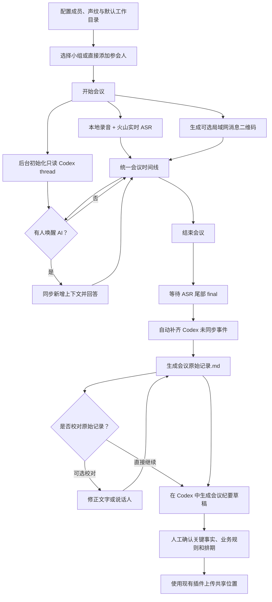

# 会意 MeetSieve PRD 与产品设计

- 文档状态：需求基线已确认
- 中文名称：会意
- 英文名称：MeetSieve
- 项目名称：`meet-sieve`
- AI 助手昵称与默认唤醒词：会来事儿
- 产品性质：组内自用工具，不面向商业化
- 首发平台：macOS、Windows
- 技术约束：客户端以 Go 为主，本地优先
- 参考项目：`/Users/liu/develop/code-space/ai-discussion`
- 参考研究：`/Users/liu/develop/learn/随笔记录/20260725-AI会议助手`

## 1. 摘要

会意（MeetSieve）用于把 2～10 人的线下项目讨论持续转化为 Codex 可以直接使用的上下文。它负责本地录音、实时转写、说话人识别、会议消息与资料收集，并允许参会者在会议中通过唤醒词“会来事儿”邀请 Codex 参与分析。

会议结束后，录音人可以让同一个 Codex 会话直接生成会议纪要草稿，人工确认关键事实、业务规则和任务排期，再通过已有插件上传到共享位置。客户端本地会议数据是唯一事实源；Codex 会话即使丢失，也能通过会议号读取原始记录并重建。

## 2. 联系人与角色

| 角色 | 职责 | 备注 |
|---|---|---|
| 产品负责人 | 确认产品目标、范围和验收标准 | 当前由需求提出人承担 |
| 录音人 | 创建会议、录音、结束会议、确认纪要并上传 | 一场会议只有一个录音端 |
| 参会者 | 参与线下讨论，可选地通过局域网页面发送资料 | 不需要账号 |
| 纪要整理人 | 在 Codex 中确认会议纪要并触发后续插件流程 | 通常与录音人为同一人 |
| 开发者 | 实现客户端、ASR、声纹、Codex 交接和本地数据能力 | Go，支持 macOS、Windows |

## 3. 背景

### 3.1 当前工作方式

组内会议没有专人持续记录。会议结束后，如果需要沉淀会议纪要，整理人通常要重新回忆背景、观点、结论和任务，再向 Codex 描述一遍。

会议中需要 AI 帮助时，参会者会在自己的电脑上单独打开 Codex。由于 Codex 不知道会议前文，使用者需要重复解释大量上下文；AI 的回答也无法自然进入统一的会议记录。

### 3.2 核心问题

1. 线下口头讨论没有自动进入后续工作上下文。
2. 会中向 AI 提问时，需要重复描述背景。
3. 不同参会者各自和 AI 交互，信息无法回到会议主线。
4. 会后整理人需要重新组织会议内容，容易遗漏业务规则、分歧和排期。
5. 单独依赖 Codex thread 存储上下文存在会话丢失、历史压缩和恢复失败风险。

### 3.3 产品出发点

产品不是泛会议 SaaS，也不是单纯的语音转写或会议纪要工具。它的作用是：

> 把 Codex 拉进真实会议，使它在会中拥有讨论上下文、可以参与分析，并在会后无缝衔接纪要整理和已有业务流程。

### 3.4 产品原则

1. **本地会议数据是事实源**：Codex thread 是可恢复、可替换的工作会话。
2. **人负责正式确认**：AI 生成的是纪要草稿，未经确认不能视为正式业务记录。
3. **会中低打扰**：录音人不需要持续操作和逐句校对。
4. **按需使用 AI**：只有被唤醒时才要求 Codex 回答，不让 AI 主动打断讨论。
5. **不重复建设后续系统**：上传和共享使用现有 Codex 插件完成。
6. **没有账号系统**：成员、小组、声纹和会议都保存在本机。
7. **简单优先**：SQLite 保存结构化事实，文件目录只保留用户真正会使用的材料。

## 4. 目标

### 4.1 核心目标

#### 目标一：会后无需重新描述背景

录音人结束会议后，可以直接让 Codex 根据本场完整上下文生成会议纪要草稿，不再手工复述会议过程。

#### 目标二：会中 AI 真正拥有上下文

参会者通过唤醒词提出问题时，Codex 能结合此前讨论、会议消息、链接、附件和已关联项目进行回答。

#### 目标三：会议上下文可长期恢复

即使 Codex thread 无法恢复，也能通过会议号重新读取会议原始记录，并创建新的 Codex 会话继续工作。

### 4.2 建议的内部验证指标

以下指标用于首轮真实会议验证，不是商业化指标：

| 指标 | 建议目标 |
|---|---|
| 完整会议保存成功率 | 真实试用会议中不丢失已确认的 final 转写、消息和附件 |
| 会后交接成功率 | 结束会议后可以通过原 thread 或恢复 thread 生成纪要草稿 |
| 重新描述成本 | 整理人无需再次完整讲述会议背景 |
| 纪要可用性 | 人工以核对和修正为主，而不是重新撰写 |
| 会中 AI 上下文能力 | AI 能回答依赖此前讨论的问题，不要求重新复述全部背景 |
| 会话恢复能力 | 删除或失效原 thread 后，按会议号仍可重建上下文 |
| 任务排期准确性 | 不虚构未讨论的负责人和日期 |
| 跨设备会议冲突 | 不同录音电脑上传会议时不得静默覆盖 |

## 5. 使用场景与用户任务

### 5.1 优先场景

- 2～10 人；
- 30 分钟到 2 小时；
- 同一会议室；
- 一台电脑和一个主麦克风；
- 需求讨论；
- 业务规则确认；
- 技术方案讨论；
- 产品设计评审；
- 会后需要形成可供后续开发和讨论引用的记录。

### 5.2 暂不重点覆盖

- 泛商业会议 SaaS；
- 远程音视频会议平台；
- 多台设备同时录音和音轨融合；
- 大型培训和演讲；
- 全员汇报型会议；
- 会议审批、组织权限和账号体系；
- 自动发布未经人工确认的正式纪要。

### 5.3 用户任务

#### 录音人

1. 选择常用小组或直接添加参会者。
2. 开始录音并确认转写正常。
3. 必要时修正说话人归属。
4. 展示局域网二维码，让其他人可选地补充资料。
5. 在会议结束后直接交接给 Codex。
6. 必要时校对原始记录。
7. 确认纪要草稿并通过插件上传。

#### 普通参会者

1. 正常参加线下讨论，不强制安装客户端或打开页面。
2. 可扫描二维码进入本场会议消息页。
3. 查看人工消息、链接、附件和公开的 Codex 回答。
4. 发送文字、链接和附件。
5. 通过语音唤醒词邀请 AI 参与。

## 6. 价值主张

### 6.1 对录音人与整理人

- 不需要边开会边手工记笔记；
- 不需要会后重新向 Codex 讲一遍；
- 可以从原始录音和转写追溯关键结论；
- 可以把确认后的纪要衔接到已有上传流程。

### 6.2 对参会者

- 可以自然讨论，需要 AI 时直接叫它参与；
- 不需要每个人各自在电脑上建立重复上下文；
- AI 回答进入统一会议记录；
- 资料通过局域网页面集中在本场会议中。

### 6.3 相比参考项目的关键提升

参考项目已经验证了实时 ASR、匿名说话人、Codex thread、增量转写和导出能力，但产品仍偏工程 Demo。本产品设计进一步明确：

- 一场会议不是一个不可替换的 Codex thread；
- 会议结束必须补齐未同步内容；
- 消息、链接和附件与转写属于同一会议事件流；
- 支持本地成员库、小组和声纹；
- 支持按会议号让 Codex 重新读取；
- 支持一键发起纪要整理；
- 原始记录、上下文快照和会议纪要是三种不同产物。

## 7. 产品方案

### 7.1 核心概念

#### 会议原始记录

由程序根据本地事件流确定性生成，包含完整 final 转写、消息、链接、附件、AI 问答和时间戳。它用于追溯和重新读取，不由 AI 改写。

#### Codex 上下文快照

用于长会议压缩和 thread 重建的结构化状态，包括当前主题、已确认结论、关键业务规则、主要分歧、待解决问题和资料索引。它定长、滚动覆盖，不是会议纪要。

#### 会议纪要草稿

Codex 根据会议原始记录生成、供人确认和上传的文档。它按议题整理内容，并突出结论、业务规则、任务和排期。

### 7.2 端到端流程



### 7.3 信息架构

桌面客户端采用五个主要空间：

1. **首页 / 开始会议**
2. **会议中**
3. **会议详情**
4. **成员与小组**
5. **设置**

局域网访客只访问单独的“本场会议消息页”。

### 7.4 首页 / 开始会议

#### 页面目标

让录音人无需填写长表单即可开始会议。

#### 必选项

- 常用小组或直接添加参会人；
- 本场实际参会人；
- 麦克风。

#### 可选项

- 会议主题；
- 讨论背景或目标；
- 关联项目目录；
- 是否开启局域网消息页。

#### 交互规则

- 选择常用小组后，自动带出成员和默认项目目录；
- 用户仍可增减本场参会人；
- 临时添加成员时，可选择是否保存进成员库；
- 没有声纹的成员仍可参会；
- 主题为空时允许直接开始；
- 会议结束后可由 Codex 生成候选主题；
- 主按钮只有“开始会议”。

### 7.5 会议中页面

#### 页面目标

让用户确认会议正在被可靠记录，并可自然邀请 AI。

#### 布局

- 中间：会议时间线；
- 右侧：参会人、AI 状态、麦克风和转写状态；
- 底部：麦克风、请 AI 参与、结束会议；
- 顶部：会议号、主题、录音时长、局域网二维码入口。

#### 时间线内容

- final 转写；
- 当前 partial 转写；
- 人工消息；
- 链接；
- 附件；
- AI 问题；
- AI 回答；
- 说话人修正结果。

#### 视觉优先级

1. 是否正在录音；
2. 是否正在转写；
3. 当前讨论内容；
4. AI 是否可用或正在处理；
5. 低置信度说话人；
6. 技术诊断信息。

诊断信息默认折叠，仅在失败时突出。

### 7.6 AI 唤醒与现场回答

#### 唤醒形式

第一版使用“唤醒词 + 同一句问题”：

> AI 助手，比较一下刚才两个方案的风险。

#### 规则

- 只在 ASR final 中识别唤醒词；
- 从问题中移除唤醒词；
- 同一句只能触发一次；
- 设置短暂冷却时间；
- Codex 正在运行时不重复启动；
- 只说唤醒词时，提示继续说问题；
- 保留“请 AI 参与”按钮作为补救；
- AI 回复只显示文字，不做 TTS；
- 现场 Codex 使用只读权限；
- AI 回答进入会议时间线和访客消息页。

### 7.7 Codex 会话与上下文机制

#### 7.7.1 会议开始

1. 本地会议先创建成功，录音不能依赖 Codex 初始化。
2. 后台创建 Codex thread。
3. 初始消息只包含：
   - 会议背景；
   - 参会者；
   - 关联项目；
   - AI 讨论者角色；
   - 只读约束；
   - 现场回答应简短。
4. 必须等到 Codex `turn.completed` 后才能显示“AI 可参与”。
5. 初始化失败时显示“AI 暂不可用”，会议仍可继续并允许重试。

#### 7.7.2 多次 AI 参与

同一场会议始终优先恢复同一个 thread。正常情况下，只发送：

- 上次成功同步后的新增会议事件；
- 本次明确问题。

Codex thread 本身保留此前历史，不重复发送已经成功同步的全部转写。

#### 7.7.3 长时间未唤醒

如果第一次唤醒前已经积累大量未同步内容：

1. 根据模型上下文预算估算增量大小；
2. 小增量一次发送；
3. 大增量按时间或议题分段摄入；
4. 分段摄入只更新理解和上下文快照，不作为公开 AI 发言；
5. 最后一轮再发送最近原文和本次问题；
6. 页面提示“AI 正在阅读较长讨论”。

第一版不在无人使用 AI 时定时调用 Codex。

#### 7.7.4 上下文快照

快照采用结构化字段并覆盖更新：

```text
current_topics
confirmed_decisions
business_rules
disagreements
open_questions
references
```

约束：

- 不追加成无限增长的日志；
- 设置固定长度上限；
- 正常 resume 时不重复发送完整快照；
- 只在长上下文压缩、thread 重建和结束交接时使用。

#### 7.7.5 统一同步游标

同步边界不能只记录最后一条转写。所有会议事件共用一个有序游标，包括：

- final 转写；
- 人工消息；
- 链接；
- 附件；
- 说话人和文本修正；
- AI 问答。

只有 Codex turn 成功后才能推进游标。失败重试必须幂等。

#### 7.7.6 结束会议

结束流程：

1. 停止新音频采集；
2. 等待 ASR 返回尾部 final；
3. 固化会议事件；
4. 计算未同步事件；
5. 恢复同一个 thread 并执行结束同步；
6. 更新最终上下文快照；
7. 生成会议原始记录；
8. 显示“已完整交接给 Codex”。

如果 Codex 同步失败：

- 会议仍正常结束并保存；
- 状态显示“Codex 尚有内容未同步”；
- 提供“重试同步”；
- 提供恢复命令；
- 下次打开会议仍可继续补传。

### 7.8 Codex thread 丢失与按会议号读取

#### 产品原则

```text
本地会议记录 = 唯一事实源
Codex thread = 可替换的工作会话
```

#### 恢复顺序

1. 尝试恢复当前 thread；
2. 失败后创建新 thread；
3. 新 thread 读取最新上下文快照；
4. 通过会议号读取会议原始记录和资料；
5. 保存新旧 thread 的恢复关系。

#### 本地 CLI

客户端需要提供稳定的本地命令：

```bash
ai-meeting meeting list
ai-meeting meeting show 20260727-A7K2-01
ai-meeting meeting context 20260727-A7K2-01
ai-meeting meeting resources 20260727-A7K2-01
```

可选范围读取：

```bash
ai-meeting meeting context 20260727-A7K2-01 \
  --from 00:30:00 \
  --to 00:45:00
```

#### Codex Skill

随客户端提供一个本地 Codex Skill。用户可以直接说：

> 读取会议 20260727-A7K2-01，整理会议纪要。

第一版使用 CLI + Skill，不提前引入 MCP。

### 7.9 局域网会议消息页

#### 进入方式

- 录音端生成二维码和短链接；
- 页面仅在本地局域网可访问；
- 不强制所有参会者进入；
- 不需要注册账号；
- 访客从本场参会人中选择姓名。

#### 可查看内容

- 人工发送的文字；
- 链接；
- 附件和附件说明；
- 发送人与时间；
- 公开的 Codex 回答。

#### 不展示内容

- 实时语音转写；
- 原始录音；
- 声纹状态；
- Codex 内部上下文快照；
- 后台同步日志；
- 会后会议纪要草稿。

#### 可执行动作

- 发送文字；
- 发送链接；
- 上传附件；
- 下载本场可见附件。

#### 安全规则

- 每场会议使用随机、不可猜测的临时令牌；
- 会议结束后进入短暂只读宽限期，再失效；
- 录音人可以立即关闭；
- 限制附件大小和类型；
- 附件复制到本场 `resources/`；
- 访客不能浏览其他会议；
- 录音人可以删除消息或更正发送人。

### 7.10 成员、常用小组与声纹

#### 成员

保存：

- 姓名；
- 备注；
- 声纹样本；
- 模型版本；
- 声纹向量；
- 样本质量状态。

#### 常用小组

保存：

- 小组名称；
- 默认成员；
- 默认项目目录；
- 常用会议设置。

创建会议时允许选择小组，也允许完全不使用小组而直接加人。

#### 声纹注册

- 每人导入 1～3 段清晰录音；
- 客户端复制原音频到本机成员资料；
- 本地生成向量并写入 SQLite；
- 默认保留原音频，便于模型升级后重新生成；
- 支持删除单个样本、全部声纹或仅删除原音频；
- 声纹不自动上传和同步。

#### 会议中识别

1. 火山 ASR 返回匿名 speaker 和时间范围；
2. 从本地音频截取清晰片段；
3. 本地声纹模型生成 embedding；
4. 与本场最多 10 名参会者线性比较；
5. 高置信度自动建议或绑定；
6. 低置信度显示 `unknown`；
7. 允许人工覆盖；
8. 人工修正只影响本场，不自动污染永久模板。

声纹识别是辅助判断，不能伪装成绝对准确。

### 7.11 ASR 设置

第一版仅支持火山引擎。

设置项：

- 服务：火山引擎；
- API Key；
- Resource ID；
- Endpoint；
- 测试连接；
- 麦克风测试。

产品模型保留 ASR 服务抽象，但界面不展示未实现的阿里、腾讯等灰色选项。

密钥保存到 macOS Keychain 或 Windows Credential Manager，不写入普通 SQLite、会议目录或源码。

### 7.12 原始记录校对

#### 位置

原始记录校对放在会议助手内，因为它修改的是会议事实源。

#### 非强制

用户可以跳过校对，直接让 Codex 生成会议纪要。

#### 可校对内容

- 说话人；
- ASR 文本；
- 人名和业务术语；
- 数字和日期；
- 任务负责人；
- 时间节点；
- 消息归属；
- 附件说明。

#### 交互

- 从会议详情进入“查看和校对原始记录”；
- 可播放对应音频片段；
- 低置信度内容优先标记；
- 修改后重新生成原始记录 Markdown；
- 原始 ASR 文本保留，不做不可逆覆盖；
- 已同步给 Codex 的内容发生修正时，生成修正事件并在下次同步。

会议纪要的事实判断、表达和上传确认仍在 Codex 中完成。

### 7.13 会议原始记录

原始记录由代码生成，不由模型生成。

示例：

```markdown
# 会议原始记录

会议号：20260727-A7K2-01
时间：2026-07-27 14:00–15:30
参会人：张三、李四、王五

## 完整时间线

<a id="event-0012"></a>
[00:12:31–00:12:48] 张三：
声纹数据只保存在客户端，不上传业务服务。

<a id="event-0013"></a>
[00:12:49] 李四发送链接：
https://example.com/design

<a id="event-0014"></a>
[00:15:20] 王五：
AI 助手，分析一下这个方案有什么风险。

<a id="event-0015"></a>
[00:15:41] Codex：
这个方案主要有三个风险……
```

生成时机：

- 会议结束；
- 用户完成校对；
- Codex 按会议号读取；
- 用户手动导出。

### 7.14 会议纪要草稿

#### 默认结构

```markdown
# XXX 会议纪要

时间：
参会人：
会议号：
会议目标：

## 一、会议结论

- 最终确定了什么
- 确认了哪些业务规则
- 哪些方案被排除以及原因
- 哪些问题暂未得出结论

## 二、讨论内容

### 议题一：XXX

背景：

讨论要点：
- 方案、观点和主要理由
- 关键分歧
- 重要补充信息

结论：

### 议题二：XXX

……

## 三、任务与排期

| 任务/交付物 | 负责人 | 时间节点 | 前置依赖 | 备注 |
|---|---|---|---|---|

## 四、参考资料

- 链接
- 附件
- 原始会议记录入口
```

#### 规则

- “讨论内容”是纪要正文，按议题组织；
- 会议结论放在前面供快速阅读；
- 任务和排期只填写会议中实际确认的信息；
- 不明确的负责人或日期标记为“待确认”；
- 不虚构任务、负责人和时间；
- 用户确认后才能上传共享位置。

#### 原始记录引用

只对以下内容选择性引用：

- 关键业务规则；
- 最终决策；
- 易产生争议的表述；
- 明确负责人和时间节点；
- Codex 的关键分析；
- 人工修正后的重要内容。

示例：

```markdown
- 声纹数据只保存在录音端本地。
  [原始记录 00:12:31–00:14:05](会议原始记录.md#event-0012)
```

不对普通概述逐句引用，避免纪要被引用标记淹没。

原始记录默认留在本机，不自动上传。上传正式纪要后，至少保留会议号和时间范围；录音人可选择同时上传原始记录。

### 7.15 会议号

#### 展示编号

规则：

```text
YYYYMMDD-设备码-当日序号
```

示例：

```text
20260727-A7K2-01
```

- 日期：会议创建日期；
- 设备码：安装客户端时生成的稳定四位随机码；
- 序号：该设备当天创建会议的顺序号。

会议号自动生成，但允许手动修改。

#### 内部主键

每场会议另有不可变 UUID。上传共享位置时：

- 目标不存在：正常上传；
- 目标 UUID 相同：视为同一会议更新；
- 目标名称相同但 UUID 不同：禁止静默覆盖，提示冲突并生成新名称。

### 7.16 工作目录

#### 首次设置

用户选择目录后，输入框自动建议追加一级 `ai-meetings`：

```text
用户选择：/Users/liu/work
建议结果：/Users/liu/work/ai-meetings
```

用户可以删除或修改末尾目录。保存后的最终路径就是会议工作目录，客户端不再额外追加隐藏目录。

#### 目录结构

```text
会议工作目录/
├── data/
│   └── meetings.db
└── meetings/
    └── 20260727-A7K2-01-AI会议助手产品设计/
        ├── 会议原始记录.md
        ├── 会议纪要草稿.md
        ├── audio/
        │   └── recording.wav
        └── resources/
```

说明：

- `data/` 保存 SQLite 及 WAL 临时文件；
- `meetings/` 保存用户和 Codex 会直接使用的会议材料；
- 成员库、声纹、密钥和应用配置放在操作系统应用数据目录；
- 纪要草稿只有生成后才出现；
- 不额外保存与 SQLite 重复的 transcript JSONL、message JSONL 或 snapshot JSON。

#### 修改与迁移

- 保存前检查目录可写；
- 已存在数据库时验证是否属于本产品；
- 不覆盖或移动目录内其他文件；
- 修改目录后提供“一键迁移历史会议”；
- 迁移需要复制、校验、切换索引，失败时保留原目录；
- 如果目录位于 Git 仓库内，提醒用户排除 `data/`、录音和附件。

### 7.17 本地数据模型

以下是产品级实体，不限定具体表结构：

| 实体 | 作用 |
|---|---|
| Meeting | 会议基本信息、编号、UUID、状态、目录 |
| Participant | 本场参会者快照 |
| Member | 本地成员资料 |
| Group | 常用小组 |
| MeetingEvent | 统一时间线和同步顺序 |
| Utterance | partial/final 转写、speaker、时间范围 |
| Message | 人工文字消息 |
| Resource | 链接和附件 |
| AiTurn | AI 问题、回答、状态 |
| CodexSession | 当前和历史 thread |
| SyncBatch | 同步批次、边界、幂等状态 |
| ContextSnapshot | 滚动上下文快照 |
| Correction | 对原始记录的修正 |
| AudioAsset | 录音和音频片段 |
| VoiceSample | 成员声纹原音频 |
| VoiceEmbedding | 模型版本和向量 |

### 7.18 状态与失败处理

#### 会议状态

```text
准备中
录音中
结束处理中
已保存待同步
已完整交接
已生成纪要草稿
已确认并上传
```

#### 关键失败场景

| 场景 | 产品行为 |
|---|---|
| Codex 未安装 | 仍可录音；提示安装或配置路径 |
| Codex 初始化失败 | 会议继续；允许重试 |
| ASR 凭证缺失 | 禁止开始实时转写并明确提示设置 |
| ASR 断线 | 本地录音继续；重连并标记缺口 |
| 说话人不确定 | 显示未知，不强行匹配 |
| AI 唤醒失败 | 保留按钮触发 |
| AI 执行超时 | 显示失败，不推进同步游标 |
| 结束同步失败 | 会议已保存，保留“重试同步” |
| thread 丢失 | 按会议号创建恢复 thread |
| 工作目录不可写 | 阻止保存设置并说明原因 |
| 局域网页面不可访问 | 不影响录音；提示防火墙和网络状态 |
| 上传名称冲突 | 比较 UUID，禁止覆盖不同会议 |

### 7.19 数据与隐私

- 开始录音前明确提示已进入录音状态；
- 组内应事先取得参会者对录音和声纹使用的知情；
- 所有会议数据默认保存在录音人本机；
- 默认不自动上传原始录音、转写和声纹；
- 原始录音默认保留；
- 支持删除录音但保留文字；
- 支持删除整场会议；
- 支持删除成员声纹；
- 第一版不自动过期清理，只显示磁盘占用并提醒；
- 删除前说明会失去哪些回听和校对能力；
- 长期云密钥使用系统安全存储。

### 7.20 技术边界

推荐的高层结构：

```text
Go 桌面客户端
├── 桌面 UI
├── 麦克风采集与本地录音
├── 火山 ASR WebSocket
├── 本地 SQLite
├── 本地声纹模型与向量比较
├── 局域网临时消息服务
├── Codex CLI 管理
├── 本地 CLI
└── 文件与目录管理
```

首发必须分别验证 macOS 和 Windows：

- 麦克风授权；
- 防火墙和局域网访问；
- Keychain / Credential Manager；
- ONNX Runtime 动态库；
- Codex CLI 路径和进程；
- 文件选择；
- 应用签名、安装与升级。

## 8. 发布方案

### 8.1 技术验证阶段

目标：证明最危险的链路真实可用。

范围：

- 两小时录音和火山 ASR；
- final、speaker 和断线恢复；
- Codex thread 创建、resume、丢失重建；
- 结束时尾部同步；
- 会议号读取；
- 本地声纹模型在真实会议室的识别效果；
- macOS、Windows 最小包验证。

退出条件：

- 不使用 mock 伪装真实链路；
- 关键失败场景有可复现结果；
- 明确声纹阈值和 unknown 策略；
- 明确长会议上下文处理上限。

### 8.2 内部 MVP

范围：

- 设置工作目录；
- 成员与常用小组；
- 创建会议；
- 本地录音和实时转写；
- 说话人识别与人工修正；
- 唤醒词和按钮邀请 AI；
- 同一 Codex thread 多轮参与；
- 统一事件游标；
- 结束自动补齐与手动重试；
- 程序化原始记录 Markdown；
- 按会议号读取；
- 一键生成会议纪要草稿；
- 可选原始记录校对；
- 局域网消息、链接和附件；
- 本地删除和磁盘占用。

### 8.3 内部试用增强

根据真实会议反馈决定是否增加：

- 小组配置包导入导出；
- 更好的声纹样本质量检测；
- 更多纪要模板；
- 更细的原始记录引用；
- 会议目录迁移优化；
- 更稳定的局域网文件传输；
- 其他 ASR 平台；
- 本地 MCP。

不在验证前承诺这些能力。

## 9. MVP 验收标准

### 9.1 会前

- 可选择常用小组或直接添加参会者；
- 可勾选本场实际参会者；
- 可不填写主题；
- 可不选择关联项目目录；
- 自动生成符合规则的会议号；
- 可手动修改会议号；
- 可选择麦克风并完成测试。

### 9.2 会中

- 录音状态清晰可见；
- partial 不重复追加，final 只固化一次；
- 匿名 speaker 作用域不跨 ASR 会话；
- 声纹低置信度不强行认人；
- 人工修正说话人后，本场历史记录同步更新；
- 唤醒词同一句只触发一次；
- AI 多次参与恢复同一个 thread；
- AI 回复只显示文字；
- AI 不具备写项目文件的权限；
- 消息、链接和附件进入统一会议时间线；
- 访客只能看到会议消息区允许的内容。

### 9.3 结束

- 停止后等待尾部 final；
- 自动同步所有未发送事件；
- 同步失败不丢会议；
- 可以手动重试；
- 可以生成完整原始记录 Markdown；
- 可以跳过校对直接生成纪要；
- 纪要草稿符合四段式结构；
- 未讨论的负责人和日期不得虚构；
- 关键结论可以引用原始记录锚点。

### 9.4 恢复

- 原 thread 正常时可以继续；
- 原 thread 删除或失效后可以按会议号创建新 thread；
- 新 thread 能读取原始记录、附件索引和上下文快照；
- 恢复后可以继续生成会议纪要；
- 上传共享位置时，不得覆盖 UUID 不同的同名会议。

### 9.5 数据

- SQLite 与会议目录在用户确认的工作目录中；
- SQLite 位于 `data/`；
- 人可读产物位于 `meetings/`；
- 不生成与 SQLite 重复的 JSONL 文件；
- 修改工作目录时可以迁移历史会议；
- 删除录音和删除整场会议是两个独立动作；
- 声纹与会议资料分开存储。

## 10. 关键假设与待验证事项

| 假设 | 验证方式 |
|---|---|
| 单个主麦克风可以满足组内会议转写 | 使用真实会议室和真实设备测试 |
| 火山 speaker 在长会议中基本可用 | 两小时以上会议观察漂移与重连 |
| 本地声纹能在 10 人候选中提供有效建议 | 真实远场、短句、回声和重叠语音测试 |
| 同一 Codex thread 多轮 resume 能满足现场交互 | 连续多次唤醒和长会议测试 |
| 大段首次上下文可以在可接受时间内摄入 | 构造 30、60、120 分钟未同步转写测试 |
| 按会议号读取足以恢复 thread | 删除原 thread 后执行完整纪要生成 |
| 局域网二维码对组内使用足够低摩擦 | macOS、Windows 防火墙及手机浏览器测试 |
| 四段式纪要适合组内共享 | 用真实会议生成并由未参会成员阅读验证 |

## 11. 明确不做

- 商业化计费；
- 用户注册和登录；
- 云端成员与声纹库；
- 自动同步所有电脑的成员数据；
- 多人在线音视频；
- 远程会议平台替代；
- 自动发布未经确认的会议纪要；
- 在客户端重做共享文档和任务管理系统；
- 第一版实现多个 ASR 平台；
- 第一版持续后台调用 Codex；
- 为几十 KB 声纹向量引入向量数据库；
- 把原始录音、密钥或声纹提交到 Git。

## Provenance

Formalized by Open Design from candidate b9dbfa31-8fdf-43cd-ab96-073e1b89c84a.
