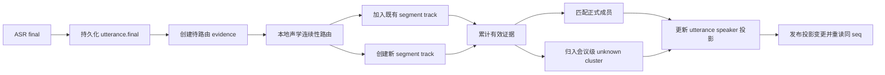

# 会中说话人投影刷新与错误分轨修复技术方案

<!-- markdownlint-disable MD013 -->

## 文档信息

| 项目 | 内容 |
| --- | --- |
| 需求名称 | 会中说话人投影刷新与错误分轨修复 |
| 项目标识 | `meet-sieve` |
| 需求号 | 未提供 |
| 文档状态 | 已实施 |
| 文档类型 | 技术设计 |
| 创建时间 | 2026-08-07 |
| 最后更新时间 | 2026-08-07 |
| 后端入口 | Wails Go 主进程、Speaker Observer / Runner / Repository |
| 前端入口 | Vue 会中统一时间线、Pinia Timeline Store |
| 涉及服务 | SQLite、火山实时 ASR、CAM++ VoiceEncoder、Wails Events |
| 外部依赖 | 火山引擎实时 ASR；不新增云服务或消息队列 |
| 配置项 | 现有声纹匹配档案升级；不新增用户可编辑设置 |
| 数据库 | SQLite 版本化 migration；不使用 AutoMigrate |
| 上线窗口 | 待确认 |
| 回滚方式 | 应用升级前数据库备份；存在新分轨事实后不做有损 down 合并 |
| 相关文档 | [会中实时 ASR 说话人识别与稳定性优化技术方案](会中实时ASR说话人识别与稳定性优化技术方案.md)、[Step 5 说话人识别技术方案](Step5-说话人识别未知聚类与人工校对技术方案.md)、[总技术方案](技术方案.md) |

## 1. 方案地位与适用范围

本文是 2026-08-07 真实双人会议验收后形成的定向修复方案。对于以下范围，本文覆盖
《会中实时 ASR 说话人识别与稳定性优化技术方案》中“一个 provider label 等于一个
speaker track”的旧实现口径：

1. 已存在时间线事件的说话人投影刷新；
2. 同一 ASR session、同一 provider speaker label 内发生真实换人；
3. 短句暂时证据不足、后续证据充分后的身份回填；
4. provider label 错误导致一个错误决定污染后续整段发言。

其他实时转写、录音保存、ASR 重连、final 幂等和人工校对约束继续沿用原方案。

本文已作为本次生产代码、数据库迁移与验证工作的实施基线；历史会议原始数据不做原地改写。

## 2. 已确认事实

### 2.1 现场会议

现场会议号为 `20260807-HAQR-01`。本次分析只读查询了本地 SQLite，未修改会议事实。
用户确认的说话人事实为：

1. “氢氧化铝抗抗酸剂不影响其吸收效率”属于刘志勇；
2. “可以让你局部的脂肪突然间被分解掉，但是你要”属于未知说话人；
3. “啊，是的”“嗯，是的”“啊，对的对的”属于刘志勇；
4. 后续药物说明长段发言属于刘志勇。

### 2.2 故障 A：数据库正确、会中页面仍显示未识别

“氢氧化铝抗抗酸剂不影响其吸收效率”在 SQLite 中与前文同属：

```text
ASR session: 7cbf7f77…
provider label: 1
speaker track: 2
track state: matched
member score: 0.7364
current participant: 刘志勇
assignment source: automatic_member
```

当前 final 提交后的执行顺序是：

```text
提交 utterance.final
  → 发布 meeting.timeline.changed
  → 前端按 after cursor 读取新 seq
  → Speaker Observer 关联 track 并继承刘志勇
```

前端已经保存该 seq 后，`recoverAfter()` 只查询更大的 seq，不会重读该记录。既有 matched
track 的 Runner 又会直接返回，不发布 `meeting.speaker.changed`。因此 SQLite 已正确，页面
仍长期停留在提交瞬间的 `unassigned` 快照。

### 2.3 故障 B：provider label 塌缩后污染整个 track

断连后的新 ASR session 把两个人的以下发言全部返回为同一个 provider label `0`：

| 顺序 | 真实说话人 | 时长 | 当前用途 |
| --- | --- | ---: | --- |
| 1 | 未知说话人 | 3.62 秒 | 进入首个 8 秒 evidence |
| 2 | 刘志勇 | 1.65 秒 | 进入首个 8 秒 evidence |
| 3 | 刘志勇 | 1.66 秒 | 进入首个 8 秒 evidence |
| 4 | 刘志勇 | 1.88 秒 | 进入首个 8 秒 evidence |
| 5 | 未知说话人 | 2.74 秒 | 首个 8 秒已满，不再使用 |
| 6 | 刘志勇 | 20.51 秒 | 首个 8 秒已满，不再使用 |
| 7 | 刘志勇 | 4.87 秒 | 首个 8 秒已满，不再使用 |

混合 evidence 对刘志勇的分数为 `0.6457`，低于当前成员阈值 `0.7`。该 track 随后进入
`clustered` 终态，所有未来同 label 发言直接继承“未知说话人 2”；后续长句不会触发重新
判断。

### 2.4 现有测试为什么没有发现

现有测试覆盖了“相同 provider label 的多条短句属于同一个真实说话人”的累计场景，但
测试前提是 provider label 正确。当前没有覆盖：

1. 相同 provider label 内实际存在两个说话人；
2. 已经展示的相同 seq 发生 `speaker_revision` 更新；
3. 终态 track 收到与原身份矛盾的新 evidence；
4. 混合 evidence 形成 unknown cluster 后，后续干净长句无法恢复。

## 3. 目标与非目标

### 3.1 目标

1. 新 final 继承已有成员或 unknown track 后，会中页面与 SQLite 在一次刷新周期内一致；
2. 同一 provider label 内发生真实换人时，不把多人音频合成一个身份 embedding；
3. 短句可以暂时显示匿名身份，后续同一人的累计证据足够时回填正式成员；
4. 一个错误或混合的早期判断不得永久污染后续发言；
5. 不降低正式成员匹配阈值，不根据文本、发言顺序或上一说话人猜身份；
6. Speaker 后台失败、队列满或应用重启后可以从 SQLite 确定性恢复；
7. 人工单条校对和本场批量校对始终高于自动重新路由。

### 3.2 非目标

1. 不保证只有 1～2 秒且没有后续同人证据的首次短句可以自动认人；
2. 不修改火山 ASR 的文本 final 边界或 VAD 阈值；
3. 不通过扩大静音时间把两个人的快速轮流发言合成一段；
4. 不自动重写历史会议中的人工校对；
5. 不在本次增加新页面、提示文案、颜色、布局或新的用户设置；
6. 不在没有真实校准记录时引入猜测性的本地分轨阈值；
7. 不使用文本语义判断说话人。

### 3.3 关键假设

1. 用户对现场会议各片段说话人的确认作为本次真实验收 ground truth；
2. 刘志勇当前 accepted 声纹样本和模型档案可用于真实重放校准；
3. 产品优先避免“错认成正式成员”，允许短句在证据累计期间暂时显示匿名身份；
4. CAM++ 短窗 embedding 是否足以支持本地连续性路由，必须由真实样本校准证明；若无法
   证明，停止第二阶段实现并评审是否引入专用 diarization 模型，不降低现有身份阈值兜底。

## 4. 总体设计

### 4.1 核心模型调整

旧模型：

```text
(ASR session, provider label) = 一个 speaker track = 一个真实说话人
```

新模型：

```text
(ASR session, provider label) = provider 通道线索
provider 通道线索 + 本地声学连续性 = 一个或多个 speaker segment track
speaker segment track + 累计证据 = 正式成员或会议级 unknown cluster
```

provider label 仍然有价值，但只用于缩小本地路由范围，不再直接证明真实身份。



### 4.2 两阶段职责

| 阶段 | 输入 | 输出 | 约束 |
| --- | --- | --- | --- |
| Continuity Routing | 单条 final 音频、provider key、同通道候选 segment | segment track | 只判断声学连续性，不直接认人 |
| Identity Attribution | segment track 累计的合格音频 | member / unknown | 继续使用正式 profile 的身份阈值和 margin |

短音频 embedding 只允许用于“是否与某个 segment 声学一致”，不能绕过 3 秒/8 秒 evidence
规则直接匹配正式成员。

## 5. 修复 A：时间线投影一致性

### 5.1 后端提交顺序

`EventService.OnPersisted` 调整为：

```text
1. 标记原始记录 dirty
2. 对 utterance.final 执行 Speaker Observer
3. 无论 Speaker Observer 成功与否，都发布首次 timeline changed
4. Speaker Observer 失败时记录脱敏错误并保留 SQLite 恢复任务
```

Speaker 是辅助能力，Observer 失败不能回滚已经成功提交的 final，也不能中断本地录音或
实时转写。调整顺序只保证正常路径的首次时间线读取发生在同步 track 关联之后。

### 5.2 明确区分“追加事件”和“投影变化”

事件语义调整为：

| 事件 | 用途 | 前端动作 |
| --- | --- | --- |
| `meeting.timeline.changed` | 新增 seq | `recoverAfter()` 拉取新事件 |
| `meeting.speaker.changed` | 已有 utterance 的 speaker 投影变化 | 重读最近可见投影并按 seq 替换 |

`Observer` 的返回值增加 `ProjectionChanged`。以下提交成功后必须发布
`meeting.speaker.changed`：

1. 新 final 继承 matched track；
2. 新 final 继承 automatic/manual cluster；
3. continuity router 把 evidence 移到新 segment；
4. Runner 完成 member/unknown attribution；
5. 后台恢复修复了原先 unassigned 的 utterance。

### 5.3 前端事实重同步

Timeline Store 新增 `refreshLatestProjection()`：

1. 查询 latest 页，但不清空用户已加载的更早记录；
2. 按 `seq` 替换同一事件，而不是只追加未知 seq；
3. DTO 增加 `speaker_revision`，只接受不小于本地 revision 的响应；
4. `meeting.speaker.changed` 调用该方法；
5. 周期性事实恢复同时执行 `recoverAfter()` 与 `refreshLatestProjection()`，即使 Wails event
   丢失也会收敛；
6. 并发请求使用请求代次或 revision 防止较旧响应覆盖较新结果。

本项不改变时间线视觉、分组、滚动位置、文案或可访问性语义。

## 6. 修复 B：同 provider label 内本地分轨

### 6.1 持久化模型

使用下一个可用 SQLite migration 版本实施，不在技术方案中预占可能冲突的版本号。

#### `speaker_tracks`

新增：

| 字段 | 说明 |
| --- | --- |
| `provider_segment_no` | 同一 `session + label` 内从 1 开始的稳定本地 segment 编号 |
| `routing_revision` | continuity router 乐观锁版本 |

约束调整：

1. provider track 唯一键从 `(asr_session_id, asr_speaker_label)` 调整为
   `(asr_session_id, asr_speaker_label, provider_segment_no)`；
2. 现有 provider track 迁移为 `provider_segment_no=1`；
3. `local_utterance` track 保持 `source_utterance_id` 唯一；
4. `display_no` 继续会议内唯一且创建后不重排。

#### `speaker_track_evidence`

新增：

| 字段 | 说明 |
| --- | --- |
| `routing_state` | `pending / routed / insufficient / failed` |
| `routing_duration_ms` | 本条用于连续性判断的真实音频时长 |
| `routing_score` | 与选中 segment 的 top-1 连续性分数 |
| `routing_margin` | top-1 与 top-2 差值 |
| 模型身份字段 | model id/version/sha256/dimension/profile id |
| `routing_embedding` | 本地恢复与确定性重放所需的短窗 embedding |

短窗 embedding 与现有声纹 embedding 一样只保存在本地 SQLite，不进入 Wails DTO、日志、
Markdown 或 LAN 响应。

### 6.2 Observe 阶段

新 final 不再因为 provider label 相同就立即继承终态 track 的正式成员：

1. final 与 provider key 持久化；
2. 创建 `routing_state=pending` 的 evidence；
3. utterance 暂时保持 `unassigned` 或已经明确的 manual assignment；
4. 非阻塞通知 continuity router；
5. 队列满时依靠 SQLite pending 查询恢复，不丢任务。

manual assignment 不进入自动重新路由，避免自动任务覆盖人工事实。

### 6.3 Continuity Router

Continuity Router 对同一 provider key 串行处理，模型计算在事务外完成：

1. 按 utterance 样本范围读取安全 PCM；
2. 执行质量检查并生成短窗 embedding；
3. 查询同一 provider key 下可参与路由的 segment centroid；
4. 计算 top-1、top-2 和 margin；
5. 同时满足校准后的 continuity score 与 margin 时加入已有 segment；
6. 不满足时创建新的 segment track；
7. 在短事务内更新 evidence、utterance 反向关联、segment centroid 和 revision；
8. 提交后唤醒 Identity Runner 并发布 speaker projection changed。

同一个 provider label 可以在 A → B → A 的轮流发言中路由回已有 A/B segment，不要求
每次换人都产生永久新编号。候选只限当前会议、当前 ASR session 和当前 provider label，
不会跨会议合并。

### 6.4 短句累计

短句处理遵循以下原则：

1. 单条不足身份 evidence 门槛时，不直接认成正式成员；
2. 短窗 embedding 可以按 continuity profile 路由到同一 segment；
3. 同一 segment 中不连续的多个短句允许累计身份 evidence；
4. segment 后续出现同人长句并达到 8 秒后，Runner 回填此前短句；
5. 会议结束时 segment 达到现有 3 秒最小证据才允许收尾匹配；
6. 仍不足 3 秒时保持匿名，不能继承上一发言人。

因此，现场三个刘志勇短回应可以先保持匿名；当后续刘志勇长句被路由到同一 segment
并达到证据门槛后，三个短句和后续长句统一回填为刘志勇。

### 6.5 Identity Runner

Runner 从“处理 provider track”调整为“处理 acoustic segment track”：

1. 只累计已经 `routed` 到本 segment 的 evidence；
2. 继续排除重叠风险和不可读音频；
3. 正式成员判断仍使用 `identity.min_score=0.7`、`identity.min_margin=0.1`；
4. unknown cluster 仍使用独立的 cluster threshold 与 margin；
5. matched/clustered 只冻结当前 segment 的身份决定，不再阻止新 utterance 先经过
   continuity routing；
6. 发生新 segment 时不修改旧 segment 的 utterance；
7. 自动提交不得覆盖 `manual_single` 或 `manual_cluster`。

不能通过把后续刘志勇长句重新加入原混合 track，再把整个 track 改为刘志勇来修复；该
做法会把现场第一条未知说话人的长句错误回填为刘志勇。

## 7. Continuity Profile 校准门

现有身份 profile 只校准“segment → member/unknown”，不能直接复用为“短窗 → segment”的
阈值。profile schema 升级后新增 `continuity` 区域，至少包含：

```json
{
  "continuity": {
    "window_ms": "由校准记录确定",
    "hop_ms": "由校准记录确定",
    "min_score": "由校准记录确定",
    "min_margin": "由校准记录确定"
  }
}
```

上述值在校准完成前不得写成运行默认值。实施前必须：

1. 从 `20260807-HAQR-01` 按用户确认边界提取脱敏样本清单；
2. 加入同人长短句、异人短间隔、静音、背景播放声和重叠说话样本；
3. 输出 same-speaker / different-speaker 分布、top-1/margin 和错误样本编号；
4. 优先选择避免跨人合并的阈值；
5. 将模型身份、样本哈希、阈值和结果写入新的 calibration record；
6. 用独立验证样本复核，不用参与选阈值的同一批数据宣称通过。

如果 CAM++ 在实际短窗上无法稳定区分现场两人，第二阶段必须停止，提交专用
diarization 模型的替代方案及包体、性能、许可证和跨平台风险供用户确认。禁止降低正式
成员阈值、使用文本内容或“上一发言人”规则伪装完成。

## 8. 并发、恢复与失败语义

### 8.1 顺序与并发

1. final 持久化继续串行且不等待 ONNX 推理；
2. continuity routing 按 provider key 串行，不允许同一 key 的后续 seq 越过前一 seq；
3. 不同 provider key 可以在现有有界 worker 中并行；
4. PCM 读取、质量分析和 ONNX 推理在数据库事务外执行；
5. track/evidence 更新使用 `routing_revision` 和现有 `revision` 乐观锁；
6. 竞争失败重新读取事实后重算，不在失败结果上叠加更新。

### 8.2 恢复

应用启动或定时恢复按最早 final seq 查询：

1. `routing_state=pending/failed(retryable)` 的 evidence；
2. `collecting/pending/rebuild_required` 的 segment track；
3. 已提交路由但未发布投影通知的 revision。

重复执行必须以 utterance ID、track ID、模型身份和 revision 幂等，不重复创建 segment、
unknown cluster 或 attribution event。

### 8.3 失败语义

| 失败 | 数据行为 | UI 行为 |
| --- | --- | --- |
| 音频尚不可读 | evidence 保持 pending | 暂时显示匿名，不影响录音/转写 |
| 短窗质量不足 | 标记 insufficient | 不猜成员，可等待后续 evidence |
| Router 推理失败 | 保存稳定错误码，可重试 | 保持匿名，不继承终态 track |
| SQLite 乐观锁冲突 | 重读后重试 | 不显示错误身份 |
| Identity Runner 失败 | 保留已路由 segment | 显示匿名或处理中，不伪装成功 |
| Wails event 丢失 | SQLite revision 保留 | 周期性 latest projection 重读收敛 |

## 9. 接口与前端影响

### 9.1 Wails DTO

Timeline utterance DTO 增加：

```text
speaker_revision: integer >= 1
```

不返回以下内部字段：

1. provider 原始 speaker label；
2. routing score/margin；
3. embedding 或模型路径；
4. 本地完整音频路径。

`meeting.speaker.changed` 保持现有事件名，payload 至少包含 `meeting_id`、`track_id`；如一次
路由移动影响多个 track，可增加不含文本的 `utterance_id` 或 revision，但前端仍以重新读取
SQLite 投影为准，事件 payload 不是事实源。

### 9.2 UI

本方案不改变现有页面的颜色、字号、尺寸、间距、圆角、阴影、布局、文案或操作流程。
会中时间线继续显示：

1. 正式成员名称；
2. 已稳定聚类的“未知说话人 N”；
3. 已建立但尚未匹配的“说话人 N”；
4. 尚未形成稳定 segment 时的“未识别说话人”。

页面刷新后必须从 Go/SQLite 重建，Pinia 只保存可丢弃缓存。现有 Timeline 的有序语义、
Speaker 文本标签和滚动行为保持不变。

## 10. 数据迁移与兼容

### 10.1 Up migration

1. 创建新结构并复制现有 `speaker_tracks`，provider 行设 `provider_segment_no=1`；
2. 复制 evidence，历史行标记为已路由但不补造短窗 embedding；
3. 重建唯一索引和外键；
4. 保留所有 track/cluster ID、display_no、人工 assignment 和 revision；
5. migration 后运行 foreign key check、索引检查和行数对账。

### 10.2 历史会议

升级不自动重新判断已结束会议，不修改人工校对。历史错误可继续通过现有校对工作台
修正。后续如要提供“重新分析说话人”，必须单独设计显式入口、影响范围确认和审计事件，
不纳入本方案。

### 10.3 回滚

一旦产生 `provider_segment_no > 1`，旧 schema 无法无损表达多个 segment。此时 down
migration 必须拒绝有损合并；完整回滚使用升级前数据库备份和对应旧版本应用。没有产生
新 segment 时可以执行结构回退，但仍需先备份并验证行数。

## 11. 实施步骤与验证

### 阶段 1：建立真实反馈环

1. 固化本次会议的脱敏片段 manifest 和用户确认边界；
2. 增加只读重放工具，不复制转写正文到日志；
3. 记录修复前输出：图一 UI stale、图二/三单 track 污染。

验证：同一 manifest 可重复得到当前错误结果。

### 阶段 2：修复投影刷新

1. 调整 final 通知与 Observer 顺序；
2. 为 Observer 增加 `ProjectionChanged`；
3. 补齐 `meeting.speaker.changed` 发布；
4. DTO 增加 `speaker_revision`；
5. 实现 `refreshLatestProjection()` 和周期性重同步。

验证：已匹配 track 的新短句首次显示或一次刷新周期内显示为刘志勇；同 seq 更高 revision
可以替换，旧响应不能回滚新状态。

### 阶段 3：校准 continuity profile

1. 扩展校准工具；
2. 生成真实短窗 embedding 分布；
3. 选择并记录 continuity 阈值；
4. 使用独立样本验证。

验证：校准记录可复现；未生成匹配模型身份的正式 profile 时，新 router 不得标记可用。

### 阶段 4：数据库与 Router

1. 新增 migration 和 schema contract；
2. Repository 支持同 provider label 多 segment；
3. evidence 持久化 routing embedding/state/revision；
4. 实现按 provider key 串行的 Continuity Router；
5. 处理恢复、幂等、乐观锁和人工校对保护。

验证：A → B → A 同 label 可以形成两个稳定 segment，并回到既有 A/B segment。

### 阶段 5：Identity Runner 接入

1. Runner 只消费 routed evidence；
2. segment 达到 8 秒或收尾达到 3 秒后判断身份；
3. member/unknown 决定回填 segment 内全部非人工 utterance；
4. terminal 只冻结 segment attribution，不跳过未来 utterance routing。

验证：现场未知长句保持 unknown，三个刘志勇短句在后续证据充分后回填刘志勇，图三长句
不再继承错误 unknown track。

### 阶段 6：回归与发布门

执行并记录：

```text
mise exec -- go test ./internal/service/speaker ./tests/integration/speaker -count=1
mise exec -- go test ./internal/service/transcript ./internal/service/content -count=1
mise exec -- go test ./cmd/... ./internal/... ./tests/unit/... ./tests/integration/... ./tests/contract/... -count=1
mise exec -- go test -race ./internal/service/speaker ./internal/service/transcript -count=1
mise exec -- go vet ./...
mise exec -- go build ./cmd/meetsieve
mise exec -- pnpm --dir frontend test
mise exec -- pnpm --dir frontend typecheck
mise exec -- pnpm --dir frontend build
```

再使用真实音频执行本方案第 12 节验收。单元测试中的固定 embedding 只证明编排和边界，
不能代替真实音频验收。

## 12. 测试矩阵与完成门

### 12.1 自动化测试

| 场景 | 预期 |
| --- | --- |
| matched track 新 final | SQLite 与 UI 同 seq 最终均为正式成员 |
| speaker event 丢失 | 周期性重读后收敛 |
| 并发旧/新 latest 响应 | 高 revision 胜出 |
| 同 label、同人多条短句 | 路由到同 segment，累计后统一回填 |
| 同 label、两人快速轮流 | 不发生跨人 segment 合并 |
| A → B → A | 最终为两个 segment，不创建三个身份 |
| 混合首段后出现 B 长句 | B 长句不能被旧 unknown 终态吞并 |
| 不足 3 秒且无后续证据 | 保持匿名，不猜人 |
| manual_single/manual_cluster | 自动路由和回填不得覆盖 |
| Router 队列满/重启 | SQLite pending 可恢复且不重复 |
| migration up | ID、display_no、人工事实和行数保持 |
| 有新 segment 时 down | 明确拒绝有损回退 |

### 12.2 真实音频验收

至少覆盖：

1. 本次 `20260807-HAQR-01` 的确认片段重放；
2. 刘志勇连续长句、短句、再长句；
3. 未登记成员连续长短句；
4. 两人间隔小于 1 秒轮流发言；
5. 两人被 provider 返回为同一个 label；
6. A → B → A 且中间存在长静音；
7. 背景播放声、重叠说话和低质量输入；
8. ASR 重连和应用重启恢复。

### 12.3 完成标准

只有同时满足以下条件才能声明修复完成：

1. 图一对应句在首次展示或一次刷新周期内显示刘志勇；
2. 图二未知说话人的长句不被标成刘志勇；
3. 图二三个刘志勇短句在累计证据足够后回填刘志勇；
4. 图三后续刘志勇长句不再永久显示为未知说话人；
5. 现有成员匹配阈值保持 `0.7/0.1`，没有“上一发言人”启发式；
6. 真实音频重放、针对性测试、全量测试、race、vet、前端构建全部给出新鲜证据；
7. 录音、本地保存、实时转写、人工校对和 Markdown 投影无回归；
8. 临时诊断不包含转写全文、声纹向量、原音频、APP Key 或完整本地路径。

## 13. 观测与性能

新增脱敏指标：

1. 每个 ASR session 的 provider label 数；
2. 每个 provider label 产生的 local segment 数；
3. continuity join/split/insufficient/failure 次数；
4. evidence 从 final 到 routed、从 routed 到 attributed 的耗时；
5. speaker projection revision 与 UI 最近确认 revision；
6. pending routing 与恢复任务数量。

日志只记录脱敏 meeting/session/track/utterance ID、模型身份、耗时、状态码和分数摘要，
不记录正文、音频、embedding、成员姓名或凭证。

发布前使用至少 30 分钟双人会议验证 CPU、内存、SQLite 大小和积压。短窗 embedding 每条
约 `192 × 4` 字节，仍需以真实会议 final 数量测量总存储，不用估算代替测量。Router 积压
只能延迟说话人显示，不能阻塞录音、final 落库或本地保存。

## 14. 风险与实施结论

| 风险 | 处理 |
| --- | --- |
| CAM++ 短窗区分度不足 | 校准门失败即停止，不降低身份阈值；评审专用 diarization 模型 |
| 每条 final 推理增加 CPU | 有界 worker、事务外推理、真实 30 分钟性能验收 |
| segment 过度拆分 | continuity score + margin 校准；同人 segment 可回到既有候选 |
| segment 错误合并 | 以避免跨人合并为阈值选择优先级；低置信度保持匿名 |
| UI 请求乱序 | speaker_revision 与请求代次共同防止旧响应覆盖 |
| migration 无法无损 down | 升级前备份；有新 segment 后禁止有损结构回退 |
| 历史错误仍存在 | 不静默改历史；继续使用校对工作台，重分析能力另立方案 |

本次实施结论：

1. 已采用“短句可暂时匿名、证据充分后回填”的正确性优先策略；
2. matching profile 已升级为 schema v2，SQLite 已增加 v17 migration；
3. CAM++ 真实会议校准通过，窗口、score 和 margin 固化在校准产物与 profile 中；
4. 未触发专用 diarization 模型的替代评审条件。
